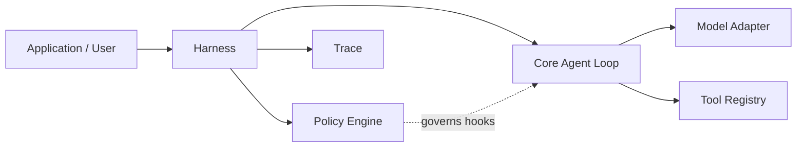

# EvoPi

[English](README.md) | [简体中文](README.zh-CN.md)

**An evolution-ready Python agent runtime with policy-governed execution.**

EvoPi provides a compact foundation for building agents that can call models, use tools, and operate inside an explicit runtime governance layer. Its stable Core handles the agent loop; Harnesses shape domain behavior; Policies inspect and control actions at well-defined lifecycle hooks.

## Why EvoPi

- **Stable agent core** — typed messages, streaming events, tool calls, tool results, and bounded multi-turn execution.
- **Pluggable harnesses** — compose prompts, tools, context, lifecycle behavior, and policies for a specific domain.
- **Policy-governed actions** — allow, block, rewrite, validate, or terminate work at runtime hooks.
- **Provider-independent models** — built-in streaming adapters for Anthropic Messages and OpenAI-compatible Chat Completions APIs.
- **Trace-first observability** — record model, tool, policy, and lifecycle events as JSONL for inspection and replay-oriented workflows.
- **Coding runtime included** — workspace-aware file and shell tools with conservative safety policies.

## Architecture



The layers have deliberately separate responsibilities:

- **Core** executes the model → tool → result → next-turn loop.
- **Harness** assembles runtime behavior and exposes governance hooks.
- **Policy** makes structured decisions at those hooks.
- **Tools** provide capabilities without deciding when their use is appropriate.
- **Trace** preserves the execution record used for debugging, evaluation, and controlled evolution.

## Requirements

- Python 3.11 or newer
- Python 3.12 recommended for development
- An Anthropic-compatible or OpenAI-compatible model endpoint

## Installation

### Conda

```powershell
git clone <repository-url>
cd EvoPi
conda env create -f environment.yml
conda activate EvoPi
```

### pip

```bash
python -m venv .venv
python -m pip install -e ".[dev]"
```

## Configuration

Copy the example environment file and provide credentials for your model provider:

```powershell
Copy-Item .env.example .env
```

Anthropic-compatible endpoints use:

```dotenv
EVOPI_PROVIDER=anthropic
ANTHROPIC_BASE_URL=https://api.anthropic.com
ANTHROPIC_AUTH_TOKEN=your-api-key
ANTHROPIC_MODEL=your-model-name
```

OpenAI-compatible endpoints use:

```dotenv
EVOPI_PROVIDER=openai-compatible
OPENAI_BASE_URL=https://api.openai.com/v1
OPENAI_API_KEY=your-api-key
OPENAI_MODEL=your-model-name
```

Credentials are loaded from the environment or a local `.env` file. EvoPi does not persist or print resolved API keys.

## Quick start

Run the coding agent in the current directory:

```powershell
evopi 'Inspect this project and summarize its architecture.'
```

Choose a provider or workspace explicitly:

```powershell
evopi --provider anthropic --workspace C:\path\to\project 'Run the tests and explain any failures.'
```

On PowerShell, single quotes are recommended when a prompt contains spaces or quotation marks.

## Python API

```python
import asyncio
from pathlib import Path

from evopi.ai import model_from_environment
from evopi.coding import CodingHarness
from evopi.cli.confirmation import terminal_confirmation_handler


async def main() -> None:
    harness = CodingHarness(
        model=model_from_environment(),
        workspace=Path.cwd(),
        trace_path=Path(".evopi/trace.jsonl"),
        confirmation_handler=terminal_confirmation_handler,
    )
    response = await harness.prompt("Review the project structure.")
    print(response.content)


asyncio.run(main())
```

For a minimal agent without the coding harness, see [`examples/basic_agent.py`](examples/basic_agent.py). The ready-to-run CLI entry point is demonstrated in [`examples/coding_agent.py`](examples/coding_agent.py).

## Lifecycle and termination

EvoPi exposes Pi-style lifecycle events for messages, turns, and tool execution. Clients can correlate `tool_execution_start` and `tool_execution_end` by `tool_call_id`, inspect `is_error`, and use `turn_end` or `agent_end` without parsing natural-language output.

`ToolResult.terminate` is a batch-level early-termination hint. EvoPi finishes every tool call requested by the current assistant message and skips the next model call only when every final result in the non-empty batch sets `terminate=True`. A blocked, denied, missing, or failed tool normally returns an error result and allows the model to explain it on the next turn.

`Agent.prompt()` continues to return an `AssistantMessage`. Structured completion details are available through `Agent.last_run` and `agent_end`, using the reasons `completed`, `terminated`, `aborted`, `error`, and `turn_limit`. Active cancellation is reserved for the next lifecycle phase.

## Runtime governance

The included `CodingHarness` registers workspace-scoped tools for directory listing, file reads, file writes, and shell commands. Its default policy pack adds:

- destructive shell-pattern blocking;
- human confirmation before non-blocked shell commands;
- write-target containment within the workspace;
- tool-output truncation;
- post-edit test guidance.

Policies are ordinary typed Python components and can be registered individually or grouped into reusable policy packs. Policy decisions are emitted into the runtime trace alongside model and tool events.

The `evopi` CLI installs an interactive `y/N` confirmation handler automatically. Library users can inject their own synchronous or asynchronous handler; without one, confirmation requests are denied by default.

### Offline policy replay

EvoPi can replay a candidate `before_tool_call` Policy against historical JSONL traces without calling a model, executing tools, or requesting human confirmation:

```python
import asyncio

from evopi.policy.builtins import ShellSafetyPolicy
from evopi.validators import load_before_tool_replay_cases, replay_policy

policy = ShellSafetyPolicy()
cases = load_before_tool_replay_cases(
    ".evopi/trace.jsonl",
    policy_name=policy.name,
)
report = asyncio.run(replay_policy(policy, cases))

print(report.unchanged_count, report.changed_count, report.passed)
```

Replay compares the candidate decision with the historical decision from the same Policy name. Changes to the action or rewritten arguments are reported as `changed` for supervisor or human review, while malformed traces, candidate execution errors, and empty case sets fail the report. New Trace records use lifecycle schema v2; unversioned v1 records and traces created before Policy evaluation snapshots remain replayable without rewriting the historical files.

> [!IMPORTANT]
> Policy checks reduce accidental risk but are not an operating-system sandbox. Review and strengthen policies before running EvoPi against untrusted prompts, repositories, or commands.

## Development

Install the development dependencies, then run:

```bash
python -m pytest -q
python -m ruff check .
python -m mypy evopi
```

The architecture documents under [`docs/design`](docs/design) describe the Core, Harness, Policy, and project structure in greater detail.

## Contributing

Issues and pull requests are welcome. Keep changes focused, include tests for behavioral changes, and preserve the separation between stable Core mechanics and domain-specific Harness or Policy behavior.
