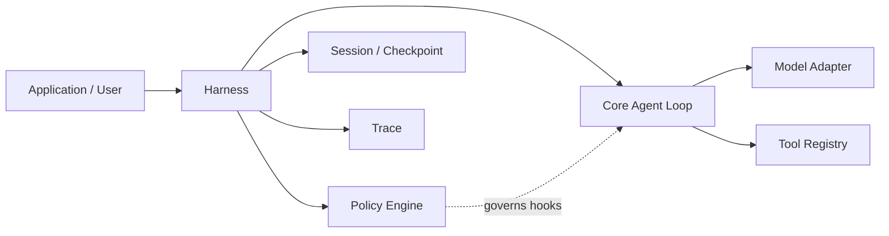

# EvoPi

[English](README.md) | [简体中文](README.zh-CN.md)

**An evolution-ready Python agent runtime with policy-governed execution.**

EvoPi provides a compact foundation for building agents that can call models, use tools, and operate inside an explicit runtime governance layer. Its stable Core handles the agent loop; Harnesses shape domain behavior; Policies inspect and control actions at well-defined lifecycle hooks.

## Why EvoPi

- **Stable agent core** — typed messages, streaming events, tool calls, tool results, and bounded multi-turn execution.
- **Pluggable harnesses** — compose prompts, tools, context, lifecycle behavior, and policies for a specific domain.
- **Policy-governed actions** — allow, block, rewrite, validate, or terminate work at runtime hooks.
- **Reliable provider boundary** — built-in Anthropic Messages and OpenAI-compatible adapters normalize errors, enforce streaming I/O timeouts, and support observable retries.
- **Durable sessions** — resume workspace conversations across CLI processes with an append-only Session log and verified Run-end checkpoints.
- **Trace-first observability** — record model, tool, policy, and lifecycle events as JSONL for inspection and replay-oriented workflows.
- **Coding runtime included** — workspace-aware file and shell tools with conservative safety policies.

## Architecture



The layers have deliberately separate responsibilities:

- **Core** executes the model → tool → result → next-turn loop.
- **Harness** assembles runtime behavior and exposes governance hooks.
- **Policy** makes structured decisions at those hooks.
- **Tools** provide capabilities without deciding when their use is appropriate.
- **Session** preserves committed conversation state across Runs and processes.
- **Trace** preserves the execution record used for debugging, evaluation, and controlled evolution.

## Requirements

- Python 3.11 or newer
- Python 3.12 recommended for development
- An Anthropic-compatible or OpenAI-compatible model endpoint

## Installation

### Conda

```powershell
git clone <repository-url>
cd EvoPi
conda env create -f environment.yml
conda activate EvoPi
```

### pip

```bash
python -m venv .venv
python -m pip install -e ".[dev]"
```

## Configuration

Copy the example environment file and provide credentials for your model provider:

```powershell
Copy-Item .env.example .env
```

Anthropic-compatible endpoints use:

```dotenv
EVOPI_PROVIDER=anthropic
ANTHROPIC_BASE_URL=https://api.anthropic.com
ANTHROPIC_AUTH_TOKEN=your-api-key
ANTHROPIC_MODEL=your-model-name
```

OpenAI-compatible endpoints use:

```dotenv
EVOPI_PROVIDER=openai-compatible
OPENAI_BASE_URL=https://api.openai.com/v1
OPENAI_API_KEY=your-api-key
OPENAI_MODEL=your-model-name
```

Credentials are loaded from the environment or a local `.env` file. EvoPi does not persist or print resolved API keys.

## Quick start

Run the coding agent in the current directory:

```powershell
evopi 'Inspect this project and summarize its architecture.'
```

Choose a provider or workspace explicitly:

```powershell
evopi --provider anthropic --workspace C:\path\to\project 'Run the tests and explain any failures.'
```

Harness-backed CLI runs retry transient model failures up to three additional times by default. Control this behavior explicitly when needed:

```powershell
evopi --max-retries 5 --model-timeout 90 'Review this repository.'
evopi --no-retry 'Run this task without automatic model retries.'
```

On PowerShell, single quotes are recommended when a prompt contains spaces or quotation marks.

### Sessions

The CLI automatically continues the most recently updated Session for the current workspace.
Use explicit selection when needed:

```powershell
evopi --new-session 'Start a separate task.'
evopi --session SESSION_ID 'Continue this specific task.'
evopi --no-session 'Run without disk persistence.'
evopi session list
evopi session list --all --json
```

Use `--session-root PATH` or `EVOPI_SESSION_DIR` to override the default
`~/.evopi/sessions/` location. Session notices and recovery warnings are written to stderr;
model text remains on stdout.

## Python API

```python
import asyncio
from pathlib import Path

from evopi.ai import model_from_environment
from evopi.coding import CodingHarness
from evopi.cli.confirmation import async_terminal_confirmation_handler
from evopi.session import SessionManager


async def main() -> None:
    workspace = Path.cwd()
    session = SessionManager.continue_recent(workspace)
    harness = CodingHarness(
        model=model_from_environment(),
        workspace=workspace,
        trace_path=Path(".evopi/trace.jsonl"),
        confirmation_handler=async_terminal_confirmation_handler,
        session_manager=session,
    )
    try:
        response = await harness.prompt("Review the project structure.")
        print(response.content)
    finally:
        harness.close()


asyncio.run(main())
```

For a minimal agent without the coding harness, see [`examples/basic_agent.py`](examples/basic_agent.py). The ready-to-run CLI entry point is demonstrated in [`examples/coding_agent.py`](examples/coding_agent.py).

Library Harnesses use an in-memory Session unless a `SessionManager` is supplied, so importing
EvoPi never creates implicit global files. Persistent Session logs contain prompts, model
responses, and tool outputs in local plaintext; protect the Session root like a Trace directory.

## Lifecycle and termination

EvoPi exposes Pi-style lifecycle events for messages, turns, and tool execution. Clients can correlate `tool_execution_start` and `tool_execution_end` by `tool_call_id`, inspect `is_error`, and use `turn_end` or `agent_end` without parsing natural-language output.

`ToolResult.terminate` is a batch-level early-termination hint. EvoPi finishes every tool call requested by the current assistant message and skips the next model call only when every final result in the non-empty batch sets `terminate=True`. A blocked, denied, missing, or failed tool normally returns an error result and allows the model to explain it on the next turn.

`Agent.prompt()` continues to return an `AssistantMessage`. Structured completion details are available through `Agent.last_run` and `agent_end`, using the reasons `completed`, `terminated`, `aborted`, `error`, and `turn_limit`.

Active runs can be stopped cooperatively with `Agent.abort()` or `BaseHarness.abort()`. The call is synchronous, thread-safe, idempotent, and has no effect while idle. Model streams and asynchronous tools are cancelled, a running shell process tree is terminated, and every requested sibling tool still receives a correlated error result. Partial model text is retained, while incomplete tool calls are removed from the committed message and preserved as diagnostic metadata. Use `signal`, `is_running`, and `wait_for_idle()` to integrate cancellation into an application lifecycle.

Cancelling the task that is awaiting `prompt()` performs the same cleanup and then re-raises `asyncio.CancelledError`. The CLI maps its first `Ctrl+C` to graceful cleanup and exits with status 130; a second interrupt retains the host runtime's force-interrupt behavior.

## Provider reliability

Model adapters translate provider HTTP responses, stream errors, timeouts, connection failures, premature EOF, and protocol failures into `ModelErrorInfo`. The normalized kinds distinguish authentication, permission, invalid requests, missing resources, context overflow, exhausted quota, rate limits, overload, timeout, connection, server, protocol, and unknown failures. Structured details are available on `ModelError.info`, `Agent.last_run.error_info`, lifecycle events, Policy error contexts, and JSONL Trace records.

Bare `Agent` instances do not retry unless given a `ModelRetryConfig`. `BaseHarness` and `CodingHarness` enable deterministic retries by default: up to three additional full model attempts with 2/4/8-second backoff. Only transient `rate_limited`, `overloaded`, `timeout`, `connection`, and `server` errors retry. A longer valid `Retry-After` takes precedence; values above the 60-second wait ceiling fail immediately.

Every retry remains in the same Run and Turn. Context providers and `before_model_call` Policies run again for each attempt, while `after_model_call` runs only for a successful response. A failed attempt is retained in events and Trace with `stop_reason=error`, including partial text or tool-call diagnostics, but is never committed to model context. `model_retry_start` and `model_retry_end` make retry timing and outcome observable. Abort interrupts both the active stream and backoff wait.

`--model-timeout` is the connection and streaming I/O idle timeout for an individual request; it is not a wall-clock limit for the whole Run. A healthy long stream may continue as long as data keeps arriving.

To verify the batch contract directly, run:

```powershell
python -m pytest tests/core/test_agent_loop.py::test_tool_batch_terminates_only_when_every_final_result_agrees -vv
python -m pytest tests/core/test_agent_loop.py::test_mixed_tool_batch_continues_to_summary -vv
```

The first case proves that every sibling tool executes before an all-terminating batch stops the run. The second proves that one non-terminating result causes the loop to continue to the model summary.

## Runtime governance

The included `CodingHarness` registers workspace-scoped tools for directory listing, file reads, file writes, and shell commands. Its default policy pack adds:

- destructive shell-pattern blocking;
- human confirmation before non-blocked shell commands;
- write-target containment within the workspace;
- tool-output truncation;
- post-edit test guidance.

Policies are ordinary typed Python components and can be registered individually or grouped into reusable policy packs. Policy decisions are emitted into the runtime trace alongside model and tool events.

The `evopi` CLI installs an asynchronous interactive `y/N` confirmation handler automatically. Pressing `Ctrl+C` at a confirmation returns an explicit `cancelled` decision and aborts the run. Library users can inject their own synchronous or asynchronous handler; without one, confirmation requests are denied by default.

### Offline policy replay

EvoPi can replay a candidate `before_tool_call` Policy against historical JSONL traces without calling a model, executing tools, or requesting human confirmation:

```python
import asyncio

from evopi.policy.builtins import ShellSafetyPolicy
from evopi.validators import load_before_tool_replay_cases, replay_policy

policy = ShellSafetyPolicy()
cases = load_before_tool_replay_cases(
    ".evopi/trace.jsonl",
    policy_name=policy.name,
)
report = asyncio.run(replay_policy(policy, cases))

print(report.unchanged_count, report.changed_count, report.passed)
```

Replay compares the candidate decision with the historical decision from the same Policy name. Changes to the action or rewritten arguments are reported as `changed` for supervisor or human review, while malformed traces, candidate execution errors, and empty case sets fail the report. New Trace records use lifecycle schema v2; unversioned v1 records and traces created before Policy evaluation snapshots remain replayable without rewriting the historical files.

### Supervisor policy review

EvoPi can combine schema validation, isolated dry-run evidence, and Trace Replay into a deterministic technical review report:

```bash
evopi policy review my_project.policies:candidate \
  --dry-run-cases my_project.review_cases:shell_cases \
  --trace .evopi/trace.jsonl
```

Use `--json` for a stable JSON-ready report. The command exits with `0` for `passed`, `2` for `review_required`, and `1` for `failed` or a loading error. A missing dry run, a missing applicable replay, validator warnings, or changed/new replay cases require review; invalid or contradictory evidence fails the report.

The Supervisor report is an offline evidence artifact. It does not call a model, execute tools, register the candidate, or authorize activation. Human approval and the Activation Gate remain separate controls.

> [!IMPORTANT]
> Policy checks reduce accidental risk but are not an operating-system sandbox. Review and strengthen policies before running EvoPi against untrusted prompts, repositories, or commands.

## Development

Install the development dependencies, then run:

```bash
python -m pytest -q
python -m ruff check .
python -m mypy evopi
```

The architecture documents under [`docs/design`](docs/design) describe the Core, Harness, Policy, and project structure in greater detail.

## Contributing

Issues and pull requests are welcome. Keep changes focused, include tests for behavioral changes, and preserve the separation between stable Core mechanics and domain-specific Harness or Policy behavior.
