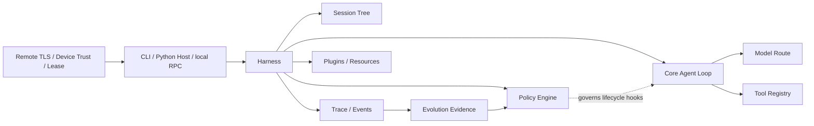

<div align="center">

# EvoPi

### Policy-governed execution for evolution-ready AI agents

Build agents that can use models and tools while every consequential action remains observable,
reviewable, and explicitly governed.

[English](README.md) · [简体中文](README.zh-CN.md)

[](https://github.com/WeiSuanDi/EvoPi/releases/latest)
[](https://github.com/WeiSuanDi/EvoPi/actions/workflows/ci.yml)
[](https://github.com/WeiSuanDi/EvoPi/actions/workflows/release.yml)
[](https://www.python.org/)
[](LICENSE)

[Install](#installation) · [Quick start](#quick-start) · [Architecture](#architecture) ·
[Governance](#runtime-governance) · [Python API](#python-api) · [Design docs](docs/design)

</div>

EvoPi is a Python agent runtime built around a simple separation of concerns: a stable **Core**
executes the agent loop, **Harnesses** assemble domain behavior, and **Policies** govern actions at
explicit lifecycle hooks. The included CodingHarness turns that runtime into an installable CLI,
while the same contracts remain available to custom Python hosts, local RPC clients, and an
optional authenticated Remote Gateway.

> [!NOTE]
> The latest release is **v0.2.0**. Windows users get a verified managed runtime, first-run model
> setup, explicit updates, and offline rollback. macOS and Linux can install the same package with
> pipx, Conda, or a virtual environment. The current source tree targets **v0.3.0** and adds the
> optional Remote Gateway described below; publishing still requires an explicit Release tag.

## What EvoPi gives you

| Runtime foundation | Governance and safety |
| --- | --- |
| Typed streaming agent loop, Tool batches, Abort, deadlines, retries, Provider failover, and strict Turn budgets. | Hook-based Policies can allow, block, rewrite, validate, confirm, or terminate without creating a second execution path. |
| **Durable host state** | **Controlled evolution** |
| Session Tree v4, checkpoints, branch/merge, compaction, steering/follow-up, Trace v2, strict local JSONL RPC, and an optional authenticated WSS Gateway. | Trace pattern discovery, evidence-bound candidate generation, isolated review, human approval, explicit activation, reload, and rollback. |

Additional product capabilities include:

- **Three model protocols** — Anthropic Messages, OpenAI-compatible Chat Completions, and native
  OpenAI Responses with Session-owned provider state.
- **Universal PluginAPI v1** — add Tools, Policies, commands, context, prompt fragments, Session
  state, Tool views, host UI, and observational handlers through one governed extension contract.
- **Coding runtime included** — workspace-scoped file and shell tools, Memory, trusted Skills,
  governed SubAgents, dynamic prompts, and conservative default Policies.
- **Trace-first evidence** — lifecycle, model, Tool, Policy, Confirmation, retry, failover, Session,
  and evolution events remain available for inspection without copying secrets into CLI output.

## Architecture



The layers have deliberately separate responsibilities:

- **Core** executes the model → tool → result → next-turn loop.
- **Harness** assembles runtime behavior and exposes governance hooks.
- **Policy** makes structured decisions at those hooks.
- **Tools** provide capabilities without deciding when their use is appropriate.
- **Session** preserves committed conversation state across Runs and processes.
- **Trace** preserves the execution record used for debugging, evaluation, and controlled evolution.

## Requirements

- Python 3.11 or newer
- Python 3.12 recommended for development
- An Anthropic-compatible or OpenAI-compatible model endpoint

## Installation

### Windows (official managed runtime)

Install [Python 3.11+](https://www.python.org/downloads/windows/) first. Python 3.12 is
recommended. You can also install it with:

```powershell
winget install --id Python.Python.3.12 -e
```

Then install the latest stable EvoPi release from PowerShell:

```powershell
irm https://github.com/WeiSuanDi/EvoPi/releases/latest/download/install.ps1 | iex
```

From CMD, invoke the same PowerShell installer:

```cmd
powershell -NoProfile -ExecutionPolicy Bypass -Command "irm https://github.com/WeiSuanDi/EvoPi/releases/latest/download/install.ps1 | iex"
```

For a review-before-execution workflow, download and inspect the installer first:

```powershell
Invoke-WebRequest https://github.com/WeiSuanDi/EvoPi/releases/latest/download/install.ps1 -OutFile install.ps1
Get-Content .\install.ps1
.\install.ps1
```

The installer verifies the Release wheel against `SHA256SUMS`, creates a user-level versioned
runtime under `~/.evopi/runtime`, and adds `~/.evopi/bin` to the current user's PATH. It never
modifies the system PATH. Open a new terminal if `evopi` is not immediately found.

### macOS and Linux

The v1 managed installer is Windows-only. Use pipx, Conda, or a virtual environment on other
platforms; those installations deliberately refuse `evopi update` self-modification.

```bash
pipx install "git+https://github.com/WeiSuanDi/EvoPi.git@v0.2.0"
```

### Development with Conda

```powershell
git clone <repository-url>
cd EvoPi
conda env create -f environment.yml
conda activate EvoPi
```

### Development with pip

```bash
python -m venv .venv
python -m pip install -e ".[dev]"
```

## Configuration

Run the first-time setup wizard after installation:

```powershell
evopi setup
```

It asks for a Provider, model name, Base URL, and a hidden API key, then performs a minimal
connection test. The selected profile is stored in `~/.evopi/config.toml`; its key is stored in
`~/.evopi/credentials.json` with user-only permissions. These files are local plaintext and must
be protected like any other credential file. Use `evopi setup --skip-test` to explicitly save an
unverified profile.

Interactive `evopi` and `evopi chat` enter setup automatically when configuration is incomplete.
Automation entries (`evopi run` and `evopi rpc`) never open a wizard and instead ask you to run
`evopi setup`. Environment variables and a workspace `.env` remain supported and take precedence
over user configuration.

For environment-only configuration, copy the example file:

```powershell
Copy-Item .env.example .env
```

Anthropic-compatible endpoints use:

```dotenv
EVOPI_PROVIDER=anthropic
ANTHROPIC_BASE_URL=https://api.anthropic.com
ANTHROPIC_AUTH_TOKEN=your-api-key
ANTHROPIC_MODEL=your-model-name
```

OpenAI-compatible endpoints use:

```dotenv
EVOPI_PROVIDER=openai-compatible
OPENAI_BASE_URL=https://api.openai.com/v1
OPENAI_API_KEY=your-api-key
OPENAI_MODEL=your-model-name
```

To use the native OpenAI Responses API with the same OpenAI credentials:

```dotenv
EVOPI_PROVIDER=openai-responses
OPENAI_BASE_URL=https://api.openai.com/v1
OPENAI_API_KEY=your-api-key
OPENAI_MODEL=your-model-name
```

`openai` and `openai-compatible` continue to select the Chat Completions adapter.
Only `openai-responses` selects the native Responses adapter.

EvoPi never prints resolved API keys. `config show`, `doctor`, `/settings`, JSON output, Session,
and Trace expose only whether a credential is configured.

## Updates

Official Windows managed runtimes update only on explicit request:

```powershell
evopi update --check
evopi update
evopi update --rollback
```

Normal startup performs no update network request. Updates accept only stable Releases from
`WeiSuanDi/EvoPi`, verify HTTPS asset hosts, `SHA256SUMS`, wheel identity and version, install into
a new runtime, run import/version/help smoke tests, and only then atomically switch the active
pointer. Failed updates preserve the current runtime. `--rollback` is offline. For automation,
use `--yes` and optionally `--json`.

## Quick start

Start the interactive workbench, or run a single task:

```powershell
evopi
evopi chat 'Inspect this project, then keep the conversation open.'
evopi 'Inspect this project and summarize its architecture.'
evopi run 'Inspect this project and summarize its architecture.'
Get-Content task.md | evopi run --json
```

The first two forms are interactive. `evopi "PROMPT"` remains the compatible one-shot form;
`evopi run` is the explicit automation entry and supports a stable, privacy-minimal JSON result.
Use `evopi --help` to discover the full `session`, `policy`, `plugin`, `config`, and `doctor`
command tree.

Choose a provider or workspace explicitly:

```powershell
evopi --provider anthropic --workspace C:\path\to\project 'Run the tests and explain any failures.'
evopi --provider openai-responses 'Inspect this project through the Responses API.'
```

Inspect effective configuration or run offline diagnostics without exposing credential values:

```powershell
evopi config show --json
evopi doctor
```

Explicit fallback routes and Tool ceilings are Harness controls:

```powershell
evopi chat --fallback openai-responses:gpt-5 --exclude-tools shell_command
evopi run --tools read_file,list_dir 'Summarize the repository without changing it.'
```

Fallback candidates are validated before the Session starts. Tool ceilings can be narrowed by
Plugins, Plan Mode, or SubAgents, but never widened by them.

Harness-backed CLI runs retry transient model failures up to three additional times by default. Control this behavior explicitly when needed:

```powershell
evopi --max-retries 5 --model-timeout 90 'Review this repository.'
evopi --max-output-tokens 8192 'Build a larger candidate incrementally.'
evopi --max-turns 40 'Complete a repository-wide task.'
evopi --shell powershell 'Inspect the repository with PowerShell syntax.'
evopi --no-retry 'Run this task without automatic model retries.'
```

The strict model Turn budget defaults to 20 and can also be set with
`EVOPI_MAX_TURNS`. `run --json`, `Agent.last_run`, lifecycle events, Trace, and the REPL expose
both the consumed and configured budget. On the final CodingHarness Turn, EvoPi removes Tools
from the model context and asks for a verified final answer; it never adds a hidden summary call.

`--shell auto|cmd|powershell` and `EVOPI_SHELL` select the `shell_command` environment with
`CLI > environment > auto` precedence. On Windows, `auto` resolves to `cmd.exe`; on POSIX it
resolves to `/bin/sh`. Explicit PowerShell prefers `pwsh` and falls back to Windows PowerShell.
The resolved executable and syntax are shown by `config show`, `doctor`, and REPL settings, and
are included in the model's dynamic Tool guidance.

On PowerShell, single quotes are recommended when a prompt contains spaces or quotation marks.

While an interactive Run is active, plain submitted text is queued as steering input instead of
starting a second Run. Use `/steer TEXT` for the same behavior explicitly, `/followup TEXT` to
continue only when the Run would otherwise finish, and `/abort` to cancel. Steering is delivered
after a complete model/tool Turn; sibling Tool calls are never split. Follow-up is delivered only
at a terminal candidate. `--steering-mode` and `--follow-up-mode` select `one-at-a-time` or `all`
queue draining, with matching `EVOPI_STEERING_MODE` and `EVOPI_FOLLOW_UP_MODE` settings.

The same host-neutral surface is available through Python (`BaseHarness.steer()` and
`BaseHarness.follow_up()`) and RPC (`run.steer` and `run.follow_up`). Accepted input becomes a
normal committed `UserMessage`, so Session and model context remain aligned; subsequent Tool
calls still pass through the existing Policy and Confirmation chain.

### Sessions

The CLI automatically continues the most recently updated Session for the current workspace.
Use explicit selection when needed:

```powershell
evopi --new-session 'Start a separate task.'
evopi --session SESSION_ID 'Continue this specific task.'
evopi --no-session 'Run without disk persistence.'
evopi session list
evopi session list --all --json
evopi session gc SESSION_ID                  # dry-run preview
evopi session gc SESSION_ID --apply --json   # validated deletion
```

Use `--session-root PATH` or `EVOPI_SESSION_DIR` to override the default
`~/.evopi/sessions/` location. Session notices and recovery warnings are written to stderr;
model text remains on stdout.

### Memory, skills, and sub-agents

The Coding CLI enables workspace Memory at `.evopi/memory.json` by default. Use
`--no-memory` for an ephemeral run or `--memory PATH` for an explicit store. Memory writes
use strict versioned persistence, sensitive-content checks, Policy hooks, and Trace events.

Skills are loaded from one explicit directory. Project Skills are considered only after
Workspace Trust, malformed or duplicate documents are reported, and injection budgets prevent
unbounded prompt growth. `--enable-subagent` exposes governed synchronous child runs; children
inherit parent safety Policies, Confirmation, Abort/Deadline, and a non-expandable Tool ceiling.

### Governed plugins

Plugin review never imports candidate Python. Approval is bound to a SHA-256 digest, and active
code is loaded from a content-addressed immutable snapshot:

```bash
evopi plugin examples
evopi plugin init my-helper --template basic
evopi plugin init plan-mode --template plan-mode
evopi plugin review ./my-plugin --json
evopi plugin approve ./my-plugin --trust-workspace
evopi plugin list --json
evopi plugin deny ./my-plugin
```

Project Plugins require both digest approval and Workspace Trust. REPL `/reload` validates
dependencies and registration conflicts in temporary registries before atomically replacing the
active Plugin capability set. Generated candidates default to
`.evopi/plugin-candidates/<name>/` and never approve or activate themselves.

When an extension is explicitly requested, the CodingHarness exposes
`create_plugin_candidate`. It creates only a packaged `basic` or `plan-mode` scaffold in that
fixed candidate directory, performs non-executing static review, and returns its digest. The
Tool has a `write` effect, respects CLI/Plan Mode ceilings, and cannot review, approve, activate,
or reload anything. The intended authoring flow is scaffold → incremental `edit_file` changes →
candidate tests → human `review → approve → reload`.

`PluginAPI v1` is a single extension surface for Tools, Policies, asynchronous Commands, Context
Providers, dynamic Prompt Fragments, branch-aware Session state, owner-scoped active Tool
restrictions, host-neutral UI, and observational events. It does not define separate Plan,
Memory, or Tool Plugin types. Approved Plugin Python runs with the current user's permissions;
the API and digest gate are governance boundaries, not an OS sandbox.

The packaged Plan Mode example is an ordinary Plugin. After explicit review, approval, and
`/reload`, `/plan on` persists planning state, contributes planning guidance, exposes only
`effects=["read"]` Tools, and adds a defensive Policy against direct effectful calls.
`/execute` asks the host UI for confirmation before restoring Tools; it does not automatically
execute the plan.

## Python API

```python
import asyncio
from pathlib import Path

from evopi.ai import model_from_environment
from evopi.coding import CodingHarness
from evopi.cli.confirmation import async_terminal_confirmation_handler
from evopi.session import SessionManager


async def main() -> None:
    workspace = Path.cwd()
    session = SessionManager.continue_recent(workspace)
    harness = CodingHarness(
        model=model_from_environment(),
        workspace=workspace,
        trace_path=Path(".evopi/trace.jsonl"),
        confirmation_handler=async_terminal_confirmation_handler,
        session_manager=session,
    )
    try:
        response = await harness.prompt("Review the project structure.")
        print(response.content)
    finally:
        harness.close()


asyncio.run(main())
```

For a minimal agent without the coding harness, see [`examples/basic_agent.py`](examples/basic_agent.py). The ready-to-run CLI entry point is demonstrated in [`examples/coding_agent.py`](examples/coding_agent.py).

Library Harnesses use an in-memory Session unless a `SessionManager` is supplied, so importing
EvoPi never creates implicit global files. Persistent Session logs contain prompts, model
responses, and tool outputs in local plaintext; protect the Session root like a Trace directory.

## Lifecycle and termination

EvoPi exposes Pi-style lifecycle events for messages, turns, and tool execution. Clients can correlate `tool_execution_start` and `tool_execution_end` by `tool_call_id`, inspect `is_error`, and use `turn_end` or `agent_end` without parsing natural-language output.

`ToolResult.terminate` is a batch-level early-termination hint. EvoPi finishes every tool call requested by the current assistant message and skips the next model call only when every final result in the non-empty batch sets `terminate=True`. A blocked, denied, missing, or failed tool normally returns an error result and allows the model to explain it on the next turn.

`Agent.prompt()` continues to return an `AssistantMessage`. Structured completion details are
available through `Agent.last_run` and `agent_end`, including `turns_used`, `max_turns`, and the
reasons `completed`, `terminated`, `aborted`, `error`, `turn_limit`, and `deadline_exceeded`.

Session logs use schema v4. Active-leaf, Plugin-state, and evidence-bound branch-merge changes are
append-only facts, keeping the Harness transcript, Agent context, Checkpoint projection, and
restart recovery aligned. Validated v1, v2, or v3 logs are backed up and atomically migrated.
Checkpoint messages and Plugin state are discarded whenever they disagree with the authoritative
active path.

Interactive sessions can transfer conclusions from another leaf with
`/merge <source-leaf-prefix> [manual summary]`. A manual summary performs no model call; when it
is omitted, EvoPi runs a governed, tool-free model operation over the source divergence. The
result is a digest-bound summary message on the target branch—source messages, tool executions,
and Plugin state are never copied or replayed. `/switch` accepts the same unique Entry prefixes,
and `/leaves` shows names, message previews, and the active leaf.

Run `evopi session gc SESSION_ID|PATH` to preview reclaimable Checkpoint cache files. The
default policy keeps three valid snapshots per existing leaf and protects every file newer than
seven days. `--apply` is required for deletion; before deleting anything EvoPi revalidates the
Session ID, Session Log digest, and every candidate's relative path, size, and digest. Session
JSONL, branches, messages, version backups, locks, Trace files, and non-Checkpoint files are never
GC candidates.

Active runs can be stopped cooperatively with `Agent.abort()` or `BaseHarness.abort()`. The call is synchronous, thread-safe, idempotent, and has no effect while idle. Model streams and asynchronous tools are cancelled, a running shell process tree is terminated, and every requested sibling tool still receives a correlated error result. Partial model text is retained, while incomplete tool calls are removed from the committed message and preserved as diagnostic metadata. Use `signal`, `is_running`, and `wait_for_idle()` to integrate cancellation into an application lifecycle.

Cancelling the task that is awaiting `prompt()` performs the same cleanup and then re-raises `asyncio.CancelledError`. The CLI maps its first `Ctrl+C` to graceful cleanup and exits with status 130; a second interrupt retains the host runtime's force-interrupt behavior.

## Provider reliability

Model adapters translate provider HTTP responses, stream errors, timeouts, connection failures, premature EOF, and protocol failures into `ModelErrorInfo`. The normalized kinds distinguish authentication, permission, invalid requests, missing resources, context overflow, exhausted quota, rate limits, overload, timeout, connection, server, protocol, and unknown failures. Structured details are available on `ModelError.info`, `Agent.last_run.error_info`, lifecycle events, Policy error contexts, and JSONL Trace records.

The native Responses adapter keeps EvoPi as the conversation-state authority: requests use
`store=false` and resend the complete committed context. Successful and incomplete responses
persist their JSON-safe provider output in `AssistantMessage.metadata`, so reasoning and other
non-executable output items can be replayed through Session and Checkpoint recovery. Older
messages and provider switches remain compatible through normalized message reconstruction.
Provider state is bound to a hashed model-and-endpoint compatibility identity; a different
candidate uses normalized text and ToolCall reconstruction instead of replaying private output
items. Malformed same-provider state fails closed before any network request.

Bare `Agent` instances do not retry unless given a `ModelRetryConfig`. `BaseHarness` and `CodingHarness` enable deterministic retries by default: up to three additional full model attempts with 2/4/8-second backoff. Only transient `rate_limited`, `overloaded`, `timeout`, `connection`, and `server` errors retry. A longer valid `Retry-After` takes precedence; values above the 60-second wait ceiling fail immediately.

Hosts that need multiple providers can pass an ordered `ModelRoute` to `BaseHarness` or
`CodingHarness`. Failover shares the existing total attempt budget, preserves the successful
candidate for the rest of the Run, and keeps circuit health in process-local memory. Transient
failures, exhausted quota, context overflow, and explicit model-unavailable codes can select the
next compatible candidate. Every candidate change—including an initial fallback because the
primary circuit is open or its context window is too small—runs the `before_model_failover`
Policy hook before any request reaches the target provider. Policy may allow, block, or require
human confirmation; unsupported actions fail closed. The hook receives the final prepared target
context, including Context Provider and Plugin Prompt contributions. Setting
`ModelFailoverConfig(enabled=False)` prevents both failure-driven and initial candidate changes.

```python
from evopi.ai import ModelCandidate, ModelRoute
from evopi.coding.harness import CodingHarness

# primary and fallback are already configured Model implementations.
route = ModelRoute(
    candidates=(
        ModelCandidate(
            candidate_id="primary",
            provider="openai-responses",
            model=primary,
            failure_domain="openai-production",
        ),
        ModelCandidate(
            candidate_id="fallback",
            provider="anthropic",
            model=fallback,
            failure_domain="anthropic-production",
        ),
    )
)
harness = CodingHarness(model=primary, model_route=route, workspace=".")
```

Failure-domain values are hashed before entering events or Trace. Circuit state and Run affinity
are deliberately not persisted or synchronized across processes; the route fingerprint is part of
the Session runtime fingerprint so configuration drift remains observable. Python hosts can supply
a `ModelRoute` directly, while the standard CLI constructs the same route from repeatable
`--fallback PROVIDER:MODEL` options.

Every retry remains in the same Run and Turn. Context providers and `before_model_call` Policies run again for each attempt, while `after_model_call` runs only for a successful response. A failed attempt is retained in events and Trace with `stop_reason=error`, including partial text or tool-call diagnostics, but is never committed to model context. `model_retry_start` and `model_retry_end` make retry timing and outcome observable. Abort interrupts both the active stream and backoff wait.

`--model-timeout` is the connection and streaming I/O idle timeout for an individual request; it is not a wall-clock limit for the whole Run. A healthy long stream may continue as long as data keeps arriving.

To verify the batch contract directly, run:

```powershell
python -m pytest tests/core/test_agent_loop.py::test_tool_batch_terminates_only_when_every_final_result_agrees -vv
python -m pytest tests/core/test_agent_loop.py::test_mixed_tool_batch_continues_to_summary -vv
```

The first case proves that every sibling tool executes before an all-terminating batch stops the run. The second proves that one non-terminating result causes the loop to continue to the model summary.

## Runtime governance

The included `CodingHarness` registers workspace-scoped tools for directory listing, file reads,
exact atomic edits, full file writes, and shell commands. Each Tool declares effects used by
Policy and Plugin Tool views. Invalid or truncated Tool JSON becomes a structured recoverable
ToolResult and never reaches Policy or the Tool handler. Its default policy pack adds:

- destructive shell-pattern blocking;
- human confirmation before non-blocked shell commands;
- write-target containment within the workspace;
- tool-output truncation;
- post-edit test guidance.

Policies are ordinary typed Python components and can be registered individually or grouped into reusable policy packs. Policy decisions are emitted into the runtime trace alongside model and tool events.

The `evopi` CLI installs an asynchronous interactive `y/N` confirmation handler automatically. Pressing `Ctrl+C` at a confirmation returns an explicit `cancelled` decision and aborts the run. Library users can inject their own synchronous or asynchronous handler; without one, confirmation requests are denied by default.

Host applications can instead launch `evopi rpc`. The Host accepts legacy RPC v1 and strict RPC
v2; the first request locks the connection version. V2 adds mandatory initialization, Run-bound
interaction handles, revision-bound Confirmation responses, and `stream_id + sequence` replay
cursors. The asynchronous Python client uses v2 exclusively:

```python
from evopi.rpc import EvoPiRpcClient

client = await EvoPiRpcClient.spawn()
run = await client.start_run("Summarize README.md")
async for event in run.events():
    ...  # typed replay + live lifecycle events
result = await run.wait()
await client.aclose()
```

RPC only resolves requests that Policy has already placed in the Confirmation Broker. It never
overrides a Policy `block` or invokes a Tool directly, and duplicate or stale responses fail
closed. This is a trusted local stdio integration surface, not an authenticated remote service.
See the [RPC v2 protocol and client contract](docs/RPC_V2_PROTOCOL.md).

### Remote Gateway (optional)

Remote Gateway exposes that same RPC v2 Host through authenticated WSS. It is a single-user,
single-workspace control surface—not a multi-tenant cloud service and not another execution path.
TLS, device authentication, `observe/control/confirm` scopes, and a single control lease sit in
front of the existing CodingHarness, so Policy blocks and revision-bound Confirmation remain
authoritative.

Remote Gateway is implemented on the current `main` branch and is planned for the v0.3.0 release.
Until that release is published, install the source preview explicitly rather than referencing a
nonexistent release tag:

```bash
python -m pip install "evopi[remote] @ git+https://github.com/WeiSuanDi/EvoPi.git@main"
```

Managed-runtime feature installation is also implemented in the v0.3.0 source. After v0.3.0 is
published, the managed installer and updater will support:

```powershell
.\install.ps1 -Feature remote
evopi update --enable-feature remote --yes
```

The current stable v0.2.0 managed runtime does not include the Remote commands; do not enable this
feature against the v0.2.0 installer.

Initialize a Host locally, issue a short-lived pairing code, approve the pending device through the
local management channel, and then serve behind a TLS reverse proxy:

```powershell
evopi remote init default --workspace C:\work\project
evopi remote pair default
evopi remote requests list default
evopi remote requests approve default REQUEST_ID --scope control --scope confirm
evopi remote serve default --proxy --bind 127.0.0.1 --port 8765 `
  --allowed-host agent.example.com --trusted-proxy 127.0.0.0/8
```

Direct non-loopback listening requires a certificate and private key and enforces TLS 1.2+. Browser
Origins are exact-match allowlisted; Python clients omit Origin. In-process limits protect bounded
application resources, while a reverse proxy, WAF, or tunnel remains responsible for volumetric
DDoS. The opt-in console is enabled with `--console`; it cannot manage devices, Policies, Plugins,
or Host configuration.

`observe` may expose sensitive Agent Events, and `confirm` can approve high-risk actions. Device
private keys, Session, Trace, and Remote Audit remain local security-sensitive material. See the
[Remote design](docs/design/REMOTE_GATEWAY.md), [wire protocol](docs/REMOTE_PROTOCOL_V1.md), and
[deployment examples](docs/deployment/remote/README.md).

### Policy pattern discovery

EvoPi can turn repeated human Tool-confirmation decisions in historical Trace files into a
deterministic, reviewable Policy Opportunity report:

```bash
evopi policy discover .evopi/trace.jsonl
evopi policy discover ./trace-archive --min-occurrences 3 --min-runs 2 --json
```

Discovery is offline: it does not call a model, execute tools, request confirmation, or create,
approve, and activate a Policy. By default, a pattern needs at least three matching decisions
across two Runs. Only explicit human `approve` and `deny` responses are evidence; automatic
denials, cancellations, and confirmations outside `before_tool_call` remain diagnostic counts.

Patterns expose stable semantic signatures derived from Tool, Policy, risk, and argument shape.
Raw commands, paths, Prompt text, and argument values are not copied into the report. Each report
binds the normalized input corpus with an aggregate digest and is stored as a digest-protected
immutable artifact under `EVOPI_HOME/opportunities/policies/`, ready for human review or a
candidate generation stage.

### Policy candidate generation

`evopi policy generate` is the governed bridge between an Opportunity report and an inactive
Policy candidate. It reconstructs the exact raw evidence referenced by the selected Opportunity
from explicit `--trace` paths, asks the configured model Provider for a Proposal in two semantic
phases (Proposal, then Candidate bundle after user confirmation), and materializes a candidate
directory that is never registered, reviewed, approved, or activated by generation:

```bash
# List opportunities first; each shows a generate hint with its signature prefix
evopi policy discover .evopi/trace.jsonl

# Generate with an explicit Trace consent boundary and terminal y/N confirmation
evopi policy generate <report-id> \
  --opportunity <signature-prefix> \
  --trace .evopi/trace.jsonl

# Scripted flow with explicit preauthorization and stable JSON output
evopi policy generate <report-id> \
  --opportunity <signature-prefix> --trace .evopi/trace.jsonl --yes --json
```

Generation never approves, activates, reloads, or registers the candidate. Passing `--trace` is
the explicit consent for sending selected raw Tool arguments to the configured model Provider;
no global Trace scan is performed. The generated candidate is inactive until it passes the formal
Review Worker, receives human approval, and is explicitly activated and reloaded.

### Offline policy replay

EvoPi can replay a candidate `before_tool_call` Policy against historical JSONL traces without calling a model, executing tools, or requesting human confirmation:

```python
import asyncio

from evopi.policy.builtins import ShellSafetyPolicy
from evopi.validators import load_before_tool_replay_cases, replay_policy

policy = ShellSafetyPolicy()
cases = load_before_tool_replay_cases(
    ".evopi/trace.jsonl",
    policy_name=policy.name,
)
report = asyncio.run(replay_policy(policy, cases))

print(report.unchanged_count, report.changed_count, report.passed)
```

Replay compares the candidate decision with the historical decision from the same Policy name. Changes to the action or rewritten arguments are reported as `changed` for supervisor or human review, while malformed traces, candidate execution errors, and empty case sets fail the report. New Trace records use lifecycle schema v2; unversioned v1 records and traces created before Policy evaluation snapshots remain replayable without rewriting the historical files.

### Supervisor policy review

EvoPi can combine schema validation, isolated dry-run evidence, and Trace Replay into a deterministic technical review report:

```bash
evopi policy review my_project.policies:candidate \
  --dry-run-cases my_project.review_cases:shell_cases \
  --trace .evopi/trace.jsonl
```

Use `--json` for a stable JSON-ready report. The command exits with `0` for `passed`, `2` for `review_required`, and `1` for `failed` or a loading error. A missing dry run, a missing applicable replay, validator warnings, or changed/new replay cases require review; invalid or contradictory evidence fails the report.

The Supervisor report is an offline evidence artifact. It does not call a model, execute tools,
register the candidate, or authorize activation. Formal directory candidates can continue through
the complete governed lifecycle:

```bash
evopi policy init safe-shell
evopi policy review .evopi/policy-candidates/safe-shell --trace .evopi/trace.jsonl
evopi policy approve REVIEW_ID
evopi policy activate APPROVAL_ID
evopi policy status --json
```

`review_required` evidence needs both `--accept-findings` and a non-empty `--reason`; failed
evidence cannot be approved. Approval copies the reviewed snapshot into an immutable,
content-addressed artifact store but does not change the runtime. Activation is a separate global
user selection. `policy deactivate NAME` and `policy rollback NAME [--to APPROVAL_ID]` change that
selection explicitly.

The Coding CLI loads active evolved Policies by default; `--no-evolved-policies` disables this for
one invocation. REPL `/policies` shows the assembled policy set and `/reload` transactionally
refreshes approved Plugins and active Policies. A collision with a built-in or Plugin Policy
requires an explicit replacement name and expected target digest. Bare `BaseHarness` remains
neutral unless a `PolicyActivationService` is supplied by its host.

> [!IMPORTANT]
> Policy checks reduce accidental risk but are not an operating-system sandbox. Review and strengthen policies before running EvoPi against untrusted prompts, repositories, or commands.

## Documentation

| Guide | Scope |
| --- | --- |
| [Global architecture](docs/design/GLOBAL_ARCHITECTURE.md) | Runtime layers, governance boundaries, and the evolution loop. |
| [Core design](docs/design/CORE_DESIGN.md) | Agent loop, lifecycle, messages, Tools, Abort, deadlines, and retries. |
| [Harness design](docs/design/HARNESS_DESIGN.md) | Context assembly, Policy hooks, Confirmation, routing, and host integration. |
| [Policy system](docs/design/POLICY_SYSTEM.md) | Decisions, replay, Supervisor evidence, candidates, approval, and activation. |
| [Session design](docs/design/SESSION_DESIGN.md) | Session Tree v4, checkpoints, recovery, compaction, merge, and GC. |
| [Plugin design](docs/design/PLUGIN_DESIGN.md) | PluginAPI v1, review, immutable snapshots, state, UI, and reload. |
| [CLI product](docs/design/CLI_PRODUCT.md) | Interactive workbench, automation, RPC, setup, and diagnostics. |
| [RPC v2 protocol](docs/RPC_V2_PROTOCOL.md) | Strict JSONL envelopes, cursors, typed client, and local trust boundary. |
| [Remote Gateway](docs/design/REMOTE_GATEWAY.md) | TLS, device trust, scopes, control lease, audit, clients, and threat boundary. |
| [Remote Protocol v1](docs/REMOTE_PROTOCOL_V1.md) | WSS authentication, control frames, RPC v2 reuse, replay, and retry rules. |
| [Distribution](docs/design/DISTRIBUTION.md) | GitHub Releases, managed Windows runtime, update, and rollback. |

## Development

Install the development dependencies, then run:

```bash
python -m pytest -q
python -m ruff check .
python -m mypy
```

The complete architecture index lives under [`docs/design`](docs/design).

## Contributing

Issues and pull requests are welcome. Keep changes focused, include tests for behavioral changes, and preserve the separation between stable Core mechanics and domain-specific Harness or Policy behavior.
