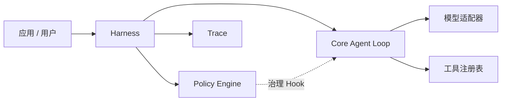

# EvoPi

[English](README.md) | [简体中文](README.zh-CN.md)

**一个以 Policy 治理执行过程、面向持续演进的 Python Agent Runtime。**

EvoPi 为构建可调用模型、使用工具并接受明确运行时治理的 Agent 提供紧凑基础。稳定的 Core 负责 Agent 主循环，Harness 组织领域行为，Policy 则在清晰定义的生命周期 Hook 上检查和控制具体动作。

## 为什么选择 EvoPi

- **稳定的 Agent Core** — 提供类型化消息、流式事件、工具调用、工具结果和有界多轮执行。
- **可插拔 Harness** — 为具体领域组合 Prompt、工具、上下文、生命周期行为和 Policy。
- **Policy 运行时治理** — 可在 Hook 上允许、阻止、改写、验证或终止操作。
- **模型提供方解耦** — 内置 Anthropic Messages 与 OpenAI-compatible Chat Completions 流式适配器。
- **Trace 优先的可观测性** — 以 JSONL 记录模型、工具、Policy 与生命周期事件，便于检查和面向回放的工作流。
- **内置编码运行时** — 提供感知工作区的文件与 Shell 工具，以及保守的默认安全策略。

## 架构



各层职责保持明确分离：

- **Core** 执行模型 → 工具 → 结果 → 下一轮的主循环。
- **Harness** 组装运行时行为并提供治理 Hook。
- **Policy** 在 Hook 上作出结构化决策。
- **Tools** 提供能力，但不自行决定何时适合使用。
- **Trace** 保存执行记录，为调试、评估和受控演进提供依据。

## 环境要求

- Python 3.11 或更高版本
- 开发环境推荐 Python 3.12
- 一个兼容 Anthropic 或 OpenAI API 的模型端点

## 安装

### Conda

```powershell
git clone <repository-url>
cd EvoPi
conda env create -f environment.yml
conda activate EvoPi
```

### pip

```bash
python -m venv .venv
python -m pip install -e ".[dev]"
```

## 配置

复制环境变量示例，并填写所使用模型服务的凭据：

```powershell
Copy-Item .env.example .env
```

Anthropic-compatible 端点使用：

```dotenv
EVOPI_PROVIDER=anthropic
ANTHROPIC_BASE_URL=https://api.anthropic.com
ANTHROPIC_AUTH_TOKEN=your-api-key
ANTHROPIC_MODEL=your-model-name
```

OpenAI-compatible 端点使用：

```dotenv
EVOPI_PROVIDER=openai-compatible
OPENAI_BASE_URL=https://api.openai.com/v1
OPENAI_API_KEY=your-api-key
OPENAI_MODEL=your-model-name
```

凭据从系统环境变量或本地 `.env` 文件加载。EvoPi 不会持久化或打印解析后的 API 密钥。

## 快速开始

在当前目录运行编码 Agent：

```powershell
evopi '检查这个项目并总结它的架构。'
```

也可以显式选择模型提供方或工作区：

```powershell
evopi --provider anthropic --workspace C:\path\to\project '运行测试并解释所有失败。'
```

在 PowerShell 中，当 Prompt 含空格或引号时，建议使用单引号包裹整个 Prompt。

## Python API

```python
import asyncio
from pathlib import Path

from evopi.ai import model_from_environment
from evopi.coding import CodingHarness
from evopi.cli.confirmation import terminal_confirmation_handler


async def main() -> None:
    harness = CodingHarness(
        model=model_from_environment(),
        workspace=Path.cwd(),
        trace_path=Path(".evopi/trace.jsonl"),
        confirmation_handler=terminal_confirmation_handler,
    )
    response = await harness.prompt("检查项目结构。")
    print(response.content)


asyncio.run(main())
```

不使用编码 Harness 的最小 Agent 示例位于 [`examples/basic_agent.py`](examples/basic_agent.py)，可直接运行的 CLI 入口示例位于 [`examples/coding_agent.py`](examples/coding_agent.py)。

## 运行时治理

内置 `CodingHarness` 会注册限定在工作区内的目录查看、文件读取、文件写入和 Shell 命令工具。默认 Policy Pack 提供：

- 危险 Shell 模式拦截；
- 未被阻断的 Shell 命令执行前人工确认；
- 写入目标工作区边界检查；
- 工具输出截断；
- 编辑后的测试提示。

Policy 是普通的类型化 Python 组件，既可以单独注册，也可以组合成可复用的 Policy Pack。Policy 决策会与模型和工具事件一起写入运行时 Trace。

`evopi` CLI 会自动安装交互式 `y/N` Confirmation Handler。Python API 用户可以注入自己的同步或异步 Handler；未配置 Handler 时，确认请求默认被拒绝。

### 离线 Policy 回放

EvoPi 可以用历史 JSONL Trace 回放候选 `before_tool_call` Policy，整个过程不会调用模型、执行工具或请求人工确认：

```python
import asyncio

from evopi.policy.builtins import ShellSafetyPolicy
from evopi.validators import load_before_tool_replay_cases, replay_policy

policy = ShellSafetyPolicy()
cases = load_before_tool_replay_cases(
    ".evopi/trace.jsonl",
    policy_name=policy.name,
)
report = asyncio.run(replay_policy(policy, cases))

print(report.unchanged_count, report.changed_count, report.passed)
```

回放会将候选决策与历史中同名 Policy 的决策进行比较。`action` 或改写参数发生变化时，结果标记为 `changed`，交给 Supervisor 或人工审查；Trace 结构损坏、候选 Policy 执行异常和空案例集会使报告不通过。对于尚未记录 Policy Evaluation 快照的旧 Trace，解析器会回退读取工具调用与 Policy 决策序列。

> [!IMPORTANT]
> Policy 检查能够降低意外操作风险，但不能替代操作系统级沙箱。在处理不可信 Prompt、仓库或命令之前，请审查并强化相应策略。

## 开发

安装开发依赖后运行：

```bash
python -m pytest -q
python -m ruff check .
python -m mypy evopi
```

[`docs/design`](docs/design) 中的架构文档进一步介绍了 Core、Harness、Policy 与项目结构。

## 参与贡献

欢迎提交 Issue 和 Pull Request。请保持改动聚焦，为行为变化补充测试，并维护稳定 Core 机制与领域 Harness、Policy 行为之间的职责边界。
