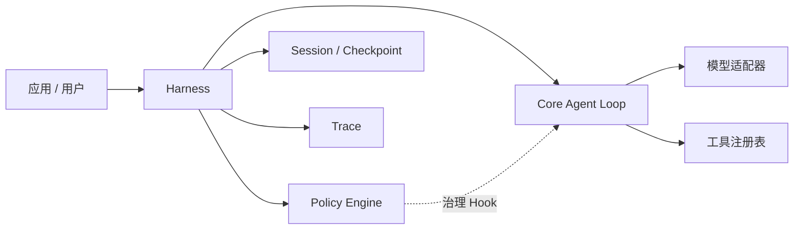

# EvoPi

[English](README.md) | [简体中文](README.zh-CN.md)

**一个以 Policy 治理执行过程、面向持续演进的 Python Agent Runtime。**

EvoPi 为构建可调用模型、使用工具并接受明确运行时治理的 Agent 提供紧凑基础。稳定的 Core 负责 Agent 主循环，Harness 组织领域行为，Policy 则在清晰定义的生命周期 Hook 上检查和控制具体动作。

## 为什么选择 EvoPi

- **稳定的 Agent Core** — 提供类型化消息、流式事件、工具调用、工具结果和有界多轮执行。
- **可插拔 Harness** — 为具体领域组合 Prompt、工具、上下文、生命周期行为和 Policy。
- **Policy 运行时治理** — 可在 Hook 上允许、阻止、改写、验证或终止操作。
- **可靠的 Provider 边界** — 内置 Anthropic Messages、OpenAI-compatible Chat Completions 与原生 OpenAI Responses 流式适配器，统一错误分类、流式 I/O 超时和可观测重试。
- **持久化 Session** — 通过追加式 Session Log 与可校验的 Run-end Checkpoint，让工作区对话跨 CLI 进程恢复。
- **通用 PluginAPI** — 通过单一受治理运行时协议扩展工具、Policy、命令、上下文、Prompt、Session 状态、Tool 视图和宿主 UI。
- **Trace 优先的可观测性** — 以 JSONL 记录模型、工具、Policy 与生命周期事件，便于检查和面向回放的工作流。
- **内置编码运行时** — 提供感知工作区的文件与 Shell 工具，以及保守的默认安全策略。

## 架构



各层职责保持明确分离：

- **Core** 执行模型 → 工具 → 结果 → 下一轮的主循环。
- **Harness** 组装运行时行为并提供治理 Hook。
- **Policy** 在 Hook 上作出结构化决策。
- **Tools** 提供能力，但不自行决定何时适合使用。
- **Session** 跨 Run 与进程保存已经提交的对话状态。
- **Trace** 保存执行记录，为调试、评估和受控演进提供依据。

## 环境要求

- Python 3.11 或更高版本
- 开发环境推荐 Python 3.12
- 一个兼容 Anthropic 或 OpenAI API 的模型端点

## 安装

### Conda

```powershell
git clone <repository-url>
cd EvoPi
conda env create -f environment.yml
conda activate EvoPi
```

### pip

```bash
python -m venv .venv
python -m pip install -e ".[dev]"
```

## 配置

复制环境变量示例，并填写所使用模型服务的凭据：

```powershell
Copy-Item .env.example .env
```

Anthropic-compatible 端点使用：

```dotenv
EVOPI_PROVIDER=anthropic
ANTHROPIC_BASE_URL=https://api.anthropic.com
ANTHROPIC_AUTH_TOKEN=your-api-key
ANTHROPIC_MODEL=your-model-name
```

OpenAI-compatible 端点使用：

```dotenv
EVOPI_PROVIDER=openai-compatible
OPENAI_BASE_URL=https://api.openai.com/v1
OPENAI_API_KEY=your-api-key
OPENAI_MODEL=your-model-name
```

使用相同 OpenAI 凭据调用原生 Responses API：

```dotenv
EVOPI_PROVIDER=openai-responses
OPENAI_BASE_URL=https://api.openai.com/v1
OPENAI_API_KEY=your-api-key
OPENAI_MODEL=your-model-name
```

`openai` 与 `openai-compatible` 继续选择 Chat Completions Adapter；只有
`openai-responses` 会选择原生 Responses Adapter。

凭据从系统环境变量或本地 `.env` 文件加载。EvoPi 不会持久化或打印解析后的 API 密钥。

## 快速开始

启动交互工作台，或执行一次性任务：

```powershell
evopi
evopi chat '先检查项目，然后继续保持对话。'
evopi '检查这个项目并总结它的架构。'
evopi run '检查这个项目并总结它的架构。'
Get-Content task.md | evopi run --json
```

前两种形式用于交互；`evopi "PROMPT"` 保留兼容的一次性语义，`evopi run` 是明确的
自动化入口，并支持稳定、最小披露的 JSON 结果。使用 `evopi --help` 可以查看完整的
`session`、`policy`、`plugin`、`config` 与 `doctor` 命令树。

也可以显式选择模型提供方或工作区：

```powershell
evopi --provider anthropic --workspace C:\path\to\project '运行测试并解释所有失败。'
evopi --provider openai-responses '通过 Responses API 检查这个项目。'
```

可以在不显示凭据值的情况下查看有效配置，或执行完全离线的诊断：

```powershell
evopi config show --json
evopi doctor
```

显式 Fallback Route 与 Tool ceiling 都属于 Harness 控制：

```powershell
evopi chat --fallback openai-responses:gpt-5 --exclude-tools shell_command
evopi run --tools read_file,list_dir '只读总结仓库，不要修改。'
```

所有 Fallback 候选会在 Session 启动前完成校验。Plugin、Plan Mode 与 SubAgent 可以继续
收窄 Tool ceiling，但不能把被 CLI 关闭的能力重新启用。

基于 Harness 的 CLI 默认会对瞬态模型错误额外重试最多三次，也可以显式调整：

```powershell
evopi --max-retries 5 --model-timeout 90 '检查这个仓库。'
evopi --max-output-tokens 8192 '用增量方式构建较大的候选。'
evopi --no-retry '执行任务，但不要自动重试模型。'
```

在 PowerShell 中，当 Prompt 含空格或引号时，建议使用单引号包裹整个 Prompt。

### Session

CLI 默认自动继续当前工作区最近更新的 Session。需要时可以显式选择：

```powershell
evopi --new-session '开始一项独立任务。'
evopi --session SESSION_ID '继续这个指定任务。'
evopi --no-session '本次不写入磁盘 Session。'
evopi session list
evopi session list --all --json
evopi session gc SESSION_ID                  # 仅预览
evopi session gc SESSION_ID --apply --json   # 校验后执行
```

可用 `--session-root PATH` 或 `EVOPI_SESSION_DIR` 覆盖默认的
`~/.evopi/sessions/`。Session 信息与恢复 warning 写入 stderr，模型文本继续写入
stdout。

### Memory、Skills 与 SubAgent

Coding CLI 默认启用工作区 `.evopi/memory.json`。可用 `--no-memory` 临时关闭，或用
`--memory PATH` 指定存储。Memory 写入经过版本化严格持久化、敏感信息检查、Policy
Hook 与 Trace 事件，不会在写盘失败时谎报成功。

Skills 只从一个明确目录加载。项目 Skill 必须先获得 Workspace Trust；损坏、重复或
非法文档会明确报告，注入预算限制 Prompt 膨胀。`--enable-subagent` 开放受治理的
同步子运行；子级继承父级安全 Policy、Confirmation、Abort/Deadline 和 Tool ceiling。

### 受治理 Plugin

Plugin 审查不会 import 候选 Python。批准记录绑定 SHA-256，运行时代码来自内容寻址的
不可变快照：

```bash
evopi plugin examples
evopi plugin init my-helper --template basic
evopi plugin init plan-mode --template plan-mode
evopi plugin review ./my-plugin --json
evopi plugin approve ./my-plugin --trust-workspace
evopi plugin list --json
evopi plugin deny ./my-plugin
```

项目 Plugin 同时需要摘要批准与 Workspace Trust。REPL `/reload` 会先在临时注册表
校验依赖和注册冲突，全部成功后才原子替换活动能力集。生成的候选默认位于
`.evopi/plugin-candidates/<name>/`，不会自行批准或激活。

`PluginAPI v1` 是统一扩展面，可注册 Tool、Policy、异步 Command、Context Provider、
动态 Prompt Fragment、分支感知的 Session 状态、所有者隔离的活动 Tool 限制、宿主
无关 UI 和观察事件；它不会预先定义 Plan、Memory、Tool 等不同 Plugin 类型。批准后
的 Python 代码以当前用户权限运行，API 与摘要门禁属于治理边界，不是 OS 沙箱。

随包提供的 Plan Mode 是普通 Plugin 样例。显式 review、approve 并 `/reload` 后，
`/plan on` 会持久化规划状态、贡献规划 Prompt、只暴露 `effects=["read"]` 的 Tool，
并注册防御性 Policy 阻断直接构造的副作用调用。`/execute` 会先通过宿主 UI 确认再
恢复 Tool，但不会自动执行计划。

## Python API

```python
import asyncio
from pathlib import Path

from evopi.ai import model_from_environment
from evopi.coding import CodingHarness
from evopi.cli.confirmation import async_terminal_confirmation_handler
from evopi.session import SessionManager


async def main() -> None:
    workspace = Path.cwd()
    session = SessionManager.continue_recent(workspace)
    harness = CodingHarness(
        model=model_from_environment(),
        workspace=workspace,
        trace_path=Path(".evopi/trace.jsonl"),
        confirmation_handler=async_terminal_confirmation_handler,
        session_manager=session,
    )
    try:
        response = await harness.prompt("检查项目结构。")
        print(response.content)
    finally:
        harness.close()


asyncio.run(main())
```

不使用编码 Harness 的最小 Agent 示例位于 [`examples/basic_agent.py`](examples/basic_agent.py)，可直接运行的 CLI 入口示例位于 [`examples/coding_agent.py`](examples/coding_agent.py)。

库中的 Harness 在未传入 `SessionManager` 时使用内存 Session，因此导入 EvoPi 不会
隐式创建全局文件。持久 Session Log 会以本地明文保存 Prompt、模型回复和工具输出，
应像保护 Trace 目录一样保护 Session 根目录。

## 生命周期与终止

EvoPi 使用 Pi 风格的消息、Turn 和工具执行生命周期事件。客户端可以通过 `tool_call_id` 关联 `tool_execution_start` 与 `tool_execution_end`，直接读取 `is_error`，并消费 `turn_end` 或 `agent_end`，无需从自然语言回答中反推运行状态。

`ToolResult.terminate` 是工具批次级的早停提示。EvoPi 会完成当前 AssistantMessage 请求的所有工具；只有非空批次中的每个最终结果都设置 `terminate=True`，才跳过下一次模型调用。Policy 阻断、确认拒绝、工具缺失或执行失败通常会返回错误结果，并允许模型在下一轮作出解释。

`Agent.prompt()` 继续返回 `AssistantMessage`。结构化结束信息通过 `Agent.last_run` 和 `agent_end` 暴露，结束原因包括 `completed`、`terminated`、`aborted`、`error` 和 `turn_limit`。

Session Log 使用 schema v4。活动叶切换、Plugin 状态和证据绑定的分支合并都是追加式
事实，因此 Harness transcript、Agent Context、Checkpoint 投影与重启恢复保持一致。
通过验证的 v1、v2 或 v3 日志会先备份再原子迁移。Checkpoint 消息或 Plugin 状态与
活动路径不一致时会被丢弃并从事实日志重建。

交互 Session 可通过 `/merge <来源叶前缀> [手工摘要]` 把另一条分支的认知结论带回
当前活动叶。提供摘要时零模型调用；省略时，EvoPi 会对来源分歧路径运行受治理、无工具
的模型操作。目标分支只增加一条与来源路径摘要绑定的上下文消息，不复制来源消息、
不重放工具，也不合并 Plugin State。`/switch` 同样接受唯一 Entry 前缀，`/leaves`
会显示分支名、消息预览和活动标记。

`evopi session gc SESSION_ID|PATH` 只预览可回收的 Checkpoint 缓存。默认对每个现存叶
保留三份有效快照，并保护最近七天内的所有文件；只有显式传入 `--apply` 才会删除。
执行前 EvoPi 会重新校验 Session ID、Session Log 摘要，以及每个候选的相对路径、大小
和摘要。Session JSONL、分支、消息、版本备份、锁、Trace 和非 Checkpoint 文件永远
不会成为 GC 候选。

运行中的任务可以通过 `Agent.abort()` 或 `BaseHarness.abort()` 协作式中止。该调用是同步、线程安全、幂等的，空闲时调用不会产生影响。模型流与异步工具会被取消，运行中的 Shell 进程树会被终止；当前批次中每个已请求的兄弟工具仍会获得可关联的错误结果。已经产生的模型文本会保留，未完成的工具调用不会写入正式消息，而是保存在诊断元数据中。应用可以通过 `signal`、`is_running` 和 `wait_for_idle()` 接入自己的生命周期。

如果外部直接取消正在等待 `prompt()` 的 Task，EvoPi 会先完成同样的清理，再重新抛出 `asyncio.CancelledError`。CLI 第一次 `Ctrl+C` 会触发优雅清理并以状态码 130 退出；第二次中断保留宿主运行时的强制中断行为。

## Provider 可靠性

模型 Adapter 会把 Provider HTTP 响应、流内错误、超时、连接失败、提前 EOF 和协议错误统一转换为 `ModelErrorInfo`。标准分类覆盖认证、权限、无效请求、资源不存在、上下文溢出、配额耗尽、限流、过载、超时、连接、服务端、协议和未知错误。结构化信息可通过 `ModelError.info`、`Agent.last_run.error_info`、生命周期事件、Policy 错误上下文和 JSONL Trace 获取。

原生 Responses Adapter 继续以 EvoPi 作为对话状态的唯一事实来源：请求固定使用
`store=false` 并重发完整的已提交上下文。成功或 incomplete 响应会把 JSON-safe Provider
输出保存在 `AssistantMessage.metadata` 中，使 reasoning 等非执行输出项能够随 Session 与
Checkpoint 恢复后原样续传。Provider State 绑定哈希后的模型与端点兼容身份；切换到不
兼容候选时只通过归一化文本和 ToolCall 重建，不会误重放私有输出项。旧消息仍可通过同一
降级路径继续使用；同名 Provider State 损坏时会在网络请求前 fail closed。

裸 `Agent` 只有显式传入 `ModelRetryConfig` 才会自动重试；`BaseHarness` 与 `CodingHarness` 默认启用确定性重试：初次调用之外最多三次，退避为 2/4/8 秒。只有 `rate_limited`、`overloaded`、`timeout`、`connection` 和 `server` 会重试。合法且更长的 `Retry-After` 优先；若超过 60 秒等待上限则立即失败。

需要多 Provider 的宿主可以向 `BaseHarness` 或 `CodingHarness` 传入有序 `ModelRoute`。
Failover 与现有 Retry 共用总 attempt 预算，并在同一个 Run 内保持成功候选亲和性；熔断
健康状态只保存在当前进程。瞬态错误、配额耗尽、上下文溢出和明确的模型不可用 code
可以切换到下一个兼容候选。任何候选变化都必须先经过 `before_model_failover` Policy，
包括主候选因熔断开启或上下文窗口不足而在第一次请求前被跳过的情况。Policy 只能允许、
阻断或要求人工确认；没有路由语义的动作会 fail closed。Hook 接收包含 Context Provider
与 Plugin Prompt 注入内容的最终目标 Context。`ModelFailoverConfig(enabled=False)` 会同时
禁止失败后切换与首次请求前的候选绕行。

```python
from evopi.ai import ModelCandidate, ModelRoute
from evopi.coding.harness import CodingHarness

# primary 与 fallback 是已经完成配置的 Model 实例。
route = ModelRoute(
    candidates=(
        ModelCandidate(
            candidate_id="primary",
            provider="openai-responses",
            model=primary,
            failure_domain="openai-production",
        ),
        ModelCandidate(
            candidate_id="fallback",
            provider="anthropic",
            model=fallback,
            failure_domain="anthropic-production",
        ),
    )
)
harness = CodingHarness(model=primary, model_route=route, workspace=".")
```

原始 failure-domain 在进入 Event/Trace 前会被哈希。Circuit 状态和 Run affinity 不持久化、
不做跨进程同步；Route 指纹会进入 Session 运行时指纹，因此配置漂移仍然可观测。v1 的
Model Route 采用显式 Python 宿主配置，标准 CLI 入口仍使用单模型配置。

所有 attempt 都属于同一个 Run 和 Turn。Context Provider 与 `before_model_call` Policy 每次都会重新运行，`after_model_call` 只处理成功响应。失败 attempt 会以 `stop_reason=error` 完整保存在 Event 与 Trace 中，包括部分文本和 ToolCall 诊断信息，但不会写入模型上下文。`model_retry_start` / `model_retry_end` 暴露重试等待和最终结果；Abort 可以打断正在进行的模型流或退避等待。

`--model-timeout` 表示单次请求的连接及流式 I/O 空闲超时，不是整个 Run 的墙钟总时限；只要数据持续到达，健康的长流可以继续运行。

可以直接运行以下命令验证批次契约：

```powershell
python -m pytest tests/core/test_agent_loop.py::test_tool_batch_terminates_only_when_every_final_result_agrees -vv
python -m pytest tests/core/test_agent_loop.py::test_mixed_tool_batch_continues_to_summary -vv
```

第一个案例证明所有兄弟工具都会执行，随后全 `terminate` 批次才停止运行；第二个案例证明只要有一个结果不终止，循环就会继续调用模型生成总结。

## 运行时治理

内置 `CodingHarness` 会注册限定在工作区内的目录查看、文件读取、精确原子编辑、
完整文件写入和 Shell 命令工具。每个 Tool 声明 effect，供 Policy 和 Plugin Tool
视图使用。非法或截断的 Tool JSON 会转换成结构化、可恢复的 ToolResult，不进入
Policy 或 Tool Handler。默认 Policy Pack 提供：

- 危险 Shell 模式拦截；
- 未被阻断的 Shell 命令执行前人工确认；
- 写入目标工作区边界检查；
- 工具输出截断；
- 编辑后的测试提示。

Policy 是普通的类型化 Python 组件，既可以单独注册，也可以组合成可复用的 Policy Pack。Policy 决策会与模型和工具事件一起写入运行时 Trace。

`evopi` CLI 会自动安装异步交互式 `y/N` Confirmation Handler。在确认界面按下 `Ctrl+C` 会产生明确的 `cancelled` 决策并中止当前运行。Python API 用户可以注入自己的同步或异步 Handler；未配置 Handler 时，确认请求默认被拒绝。

### Policy 模式发现

EvoPi 可以把历史 Trace 中反复出现的人工 Tool Confirmation 决策整理成确定性、可审查
的 Policy Opportunity Report：

```bash
evopi policy discover .evopi/trace.jsonl
evopi policy discover ./trace-archive --min-occurrences 3 --min-runs 2 --json
```

Discovery 完全离线：不调用模型、不执行工具、不请求确认，也不会创建、批准或启用
Policy。默认只有同类决策至少出现 3 次且跨 2 个 Run 才形成 Opportunity。只有真人明确
给出的 `approve/deny` 是演进证据；自动拒绝、取消和非 `before_tool_call` 确认只进入
诊断统计。

报告公开由 Tool、Policy、风险和参数结构生成的稳定语义签名，不把原始命令、路径、
Prompt 或参数值复制进报告。每份报告还用聚合输入摘要绑定规范化后的 Trace 语料，并
作为带摘要校验的不可变工件保存在
`EVOPI_HOME/opportunities/policies/`，供人工审查或未来候选生成阶段使用。

### 离线 Policy 回放

EvoPi 可以用历史 JSONL Trace 回放候选 `before_tool_call` Policy，整个过程不会调用模型、执行工具或请求人工确认：

```python
import asyncio

from evopi.policy.builtins import ShellSafetyPolicy
from evopi.validators import load_before_tool_replay_cases, replay_policy

policy = ShellSafetyPolicy()
cases = load_before_tool_replay_cases(
    ".evopi/trace.jsonl",
    policy_name=policy.name,
)
report = asyncio.run(replay_policy(policy, cases))

print(report.unchanged_count, report.changed_count, report.passed)
```

回放会将候选决策与历史中同名 Policy 的决策进行比较。`action` 或改写参数发生变化时，结果标记为 `changed`，交给 Supervisor 或人工审查；Trace 结构损坏、候选 Policy 执行异常和空案例集会使报告不通过。新 Trace 使用生命周期 schema v2；无版本的 v1 记录和尚未包含 Policy Evaluation 快照的旧 Trace 都能直接回放，无需改写历史文件。

### Supervisor Policy 审查

EvoPi 可以将 Schema 校验、隔离 Dry Run 与 Trace Replay 聚合成确定性的技术审查报告：

```bash
evopi policy review my_project.policies:candidate \
  --dry-run-cases my_project.review_cases:shell_cases \
  --trace .evopi/trace.jsonl
```

添加 `--json` 可输出稳定的 JSON-ready 报告。命令退出码为：`0` 表示 `passed`，`2` 表示 `review_required`，`1` 表示 `failed` 或加载错误。缺失 Dry Run、缺失适用的 Replay、Validator warning 或 `changed/new` 回放案例会要求审查；无效或相互矛盾的证据会使报告失败。

Supervisor Report 是离线技术证据工件。它不会调用模型、执行工具、注册候选 Policy
或授权启用。正式的目录候选可以继续进入完整受控生命周期：

```bash
evopi policy init safe-shell
evopi policy review .evopi/policy-candidates/safe-shell --trace .evopi/trace.jsonl
evopi policy approve REVIEW_ID
evopi policy activate APPROVAL_ID
evopi policy status --json
```

`review_required` 证据必须同时提供 `--accept-findings` 和非空 `--reason`；失败证据不能
批准。批准只会把已审查快照复制到不可变、内容寻址的 Artifact Store，不改变运行时。
启用是独立的用户级全局选择；`policy deactivate NAME` 和
`policy rollback NAME [--to APPROVAL_ID]` 显式改变该选择。

Coding CLI 默认加载活动的演进 Policy，单次运行可用 `--no-evolved-policies` 关闭。
REPL `/policies` 展示最终装配结果，`/reload` 在同一事务中刷新已批准 Plugin 与活动
Policy。同名替换内置或 Plugin Policy 时必须绑定目标名称和当前摘要。裸
`BaseHarness` 仍保持中立，只有宿主显式提供 `PolicyActivationService` 才接入。

> [!IMPORTANT]
> Policy 检查能够降低意外操作风险，但不能替代操作系统级沙箱。在处理不可信 Prompt、仓库或命令之前，请审查并强化相应策略。

## 开发

安装开发依赖后运行：

```bash
python -m pytest -q
python -m ruff check .
python -m mypy evopi
```

[`docs/design`](docs/design) 中的架构文档进一步介绍了 Core、Harness、Policy 与项目结构。

## 参与贡献

欢迎提交 Issue 和 Pull Request。请保持改动聚焦，为行为变化补充测试，并维护稳定 Core 机制与领域 Harness、Policy 行为之间的职责边界。
