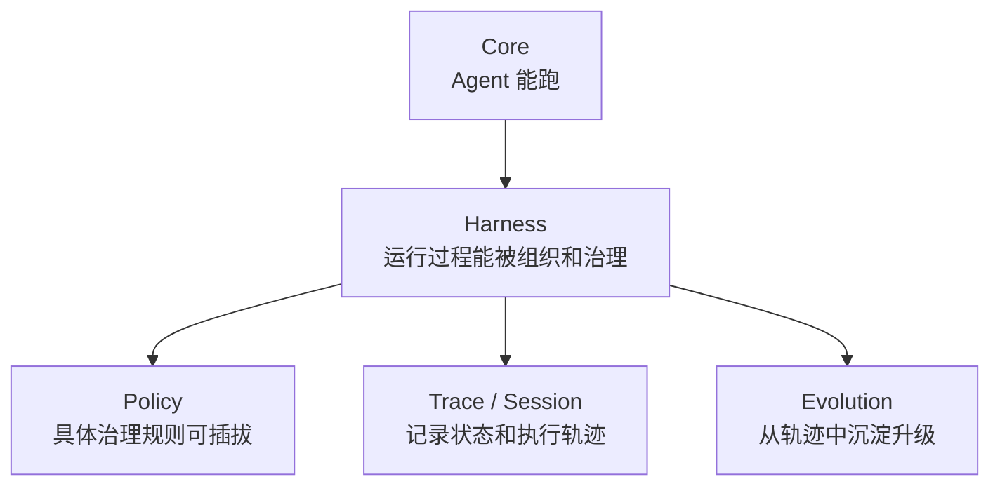
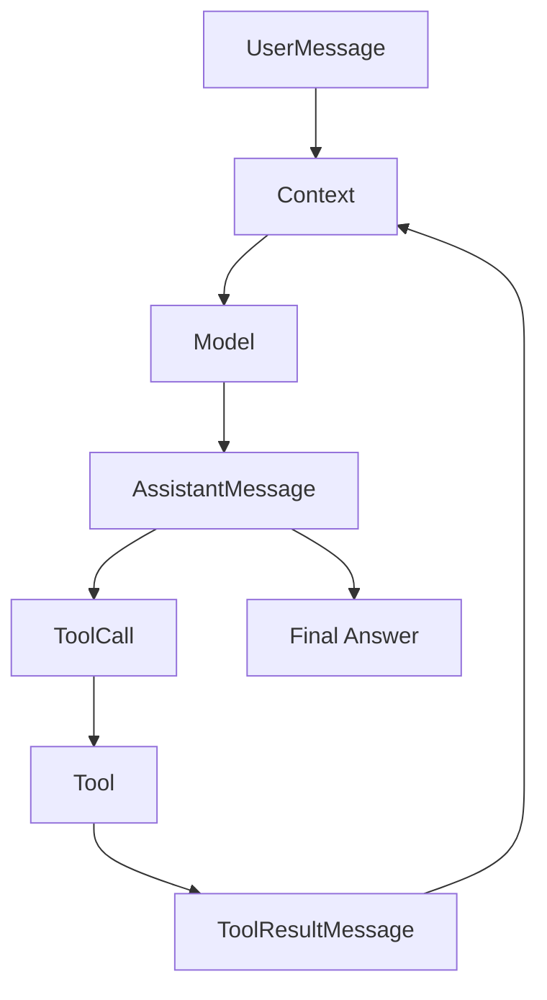

# Core 设计笔记

Core 是 EvoPi 的最小 Agent Runtime。

它只负责一件事：

```text
把用户输入、模型输出、工具调用、工具结果组织成一个稳定的多轮执行闭环。
```

Core 不应该承担具体场景治理。

例如这些不属于 Core 的主要职责：

- shell 命令是否危险
- 文件写入是否需要确认
- 金融数据是否过期
- 工具结果是否需要脱敏
- 是否需要写入长期记忆
- 是否需要创建 subagent

这些应该交给 Harness / Policy。

## Core 的核心对象

第一版 Core 固定为九项能力：

```text
1. 基础类型协议
2. 消息上下文
3. 模型统一接口
4. 工具统一接口
5. 最小 Agent Loop
6. 工具执行结果回填
7. 基础事件输出
8. Agent 对象外壳
9. 流式输出支持
```

这八项对应的原则是：

```text
Core 只负责让 Agent 能稳定跑起来。
```

它不负责让 Agent 变聪明，也不负责具体场景的治理策略。

## Core 文件边界

第一版文件分工如下：

```text
evopi/core/types.py
  基础类型协议；放跨模块共享的轻量类型。

evopi/core/messages.py
  SystemMessage / UserMessage / AssistantMessage / ToolResultMessage。

evopi/core/context.py
  AgentContext；管理当前模型调用可见的消息上下文。

evopi/core/model.py
  Model 接口；屏蔽具体模型厂商调用方式。第一版直接支持真实模型调用，FakeModel 只作为测试替身。

evopi/core/tool.py
  Tool / ToolCall / ToolResult；定义工具如何被模型请求、执行和回填。

evopi/core/events.py
  Core 级事件；表达 message、tool_call、tool_result、error 等运行过程。

evopi/core/agent_loop.py
  最小 Agent Loop；负责 model_call → tool_call → tool_result → next_turn。

evopi/core/agent.py
  Agent 对象外壳；保存 messages/tools，提供 run/prompt/subscribe/reset 等基础入口。

evopi/core/stream.py
  流式输出的辅助层；第一版就纳入 Core 边界，负责把模型流式事件转换为 Core 可消费的事件序列。
```

## Core 不包含什么

这些能力暂时不放进 Core：

```text
session 持久化
memory
skill
context compact
subagent
policy 复杂治理
用户插话 / steering / follow-up
任务树
trace replay
supervisor
```

它们属于 Harness / Policy / Evolution。

## Lifecycle v2 与四层终止协议

Core 生命周期事件采用 Pi 风格的语义：

```text
agent_start / agent_end
turn_start / turn_end
message_start / message_update / message_end
tool_execution_start / tool_execution_end
```

`model_start` 和 `error` 作为 EvoPi 观测事件保留；Policy 与 Confirmation 事件由
Harness 通过同一事件通道扩展。`turn_end` 携带 AssistantMessage 和本轮工具结果，
`agent_end` 携带本次运行新增消息、结构化结束原因和可选错误。自然完成由最后一个
Assistant `message_end` 表达，不再额外产生 `final_message`。

终止控制分为四层：

```text
工具级：ToolResult.terminate 是跳过下一次模型调用的提示
批次级：非空批次中所有最终工具结果均 terminate=True 才早停
Turn 级：ShouldStopAfterTurn 在 after_turn 观察完成后请求优雅停止
Run / Provider 级：Agent Abort 与 Provider aborted/error stop reason 独立处理
```

当前只实现前三层和结构化结束原因。`AgentEndReason` 固定为
`completed / terminated / aborted / error / turn_limit`，其中主动产生 `aborted`
留给下一阶段。`Agent.prompt()` 继续返回 AssistantMessage，结束状态由只读
`Agent.last_run` 和 `agent_end` 暴露。

工具调用仍按 AssistantMessage 中的顺序执行。单个结果的 `terminate=True` 不跳过
兄弟工具；阻断、拒绝和错误默认不早停，以便模型读取错误 ToolResult 后给出总结。

## 模型调用边界

EvoPi 第一版不只做 FakeModel。

真实模型调用进入第一版边界，原因是：

```text
Agent Runtime 的很多关键设计都和真实模型流式输出、tool call 格式、错误处理有关。
```

因此：

```text
真实模型调用是主路径；
FakeModel 是测试替身。
```

模型接入分两层：

```text
evopi/core/model.py
  定义 Core 看到的统一 Model 接口。

evopi/ai/
  负责对接具体厂商 API，并适配为统一 Model 接口。
```

第一批可优先支持：

```text
OpenAI-compatible API
Anthropic Messages API
```

后续再扩展 Gemini、DeepSeek、Qwen、本地模型等。

## 流式输出边界

流式输出进入第一版 Core。

原因：

```text
真实 Agent 产品需要及时展示模型输出、工具调用开始、工具结果和错误。
```

第一版不一定实现复杂 UI，但 Core 应该能输出事件流。

流式输出的职责拆分：

```text
Model
  产生模型厂商原始流式响应。

AI Adapter
  把厂商流式响应转换成 EvoPi 内部流式事件。

Core Stream
  消费内部流式事件，逐步构造 AssistantMessage，并向外 emit Core Event。

AgentLoop
  在流式结束后，根据完整 AssistantMessage 判断是否有 tool_calls。
```

设计原则：

```text
流式过程用于展示和增量构造；
进入 Context 的仍然是最终完整消息。
```

## Core 和上层的关系



它们的关系：



## 1. Message

Message 是整个 Core 的血液。

用户输入、模型输出、工具结果、系统提示词，最终都会以 Message 的形式进入上下文。

第一版先保留四类消息：

```text
SystemMessage
UserMessage
AssistantMessage
ToolResultMessage
```

暂时不把 DeveloperMessage、ReasoningMessage、PartialMessage 作为第一版必需项。

### SystemMessage

用于描述 Agent 的全局行为规则。

例如：

```text
你是一个 coding agent。
回答前先检查项目上下文。
危险操作前必须请求确认。
```

### UserMessage

用户输入。

它可以是普通文本，也可以在未来扩展为多模态内容。

第一版先只支持文本。

### AssistantMessage

模型输出。

它可能有两种形态：

```text
1. 普通文本回复
2. 带 tool_calls 的中间消息
```

这点很重要：AssistantMessage 不一定是最终回答。

如果它带有 tool_calls，AgentLoop 还要继续执行工具并进入下一轮模型调用。

### ToolResultMessage

工具执行结果。

它不是给用户看的最终回答，而是回填给模型的结构化消息。

它至少要表达：

- 对应哪个 tool_call
- 工具是否成功
- 工具返回内容
- 是否为错误
- 是否建议终止 loop

## Message 的初步字段边界

第一版可以先这样设计：

```text
BaseMessage
  id
  role
  content
  created_at
  metadata

AssistantMessage
  tool_calls
  stop_reason

ToolResultMessage
  tool_call_id
  tool_name
  is_error
  terminate
```

字段设计原则：

```text
Message 只描述事实，不直接做治理判断。
```

例如：

```text
terminate = True
```

只表示工具结果要求当前 loop 停止。

至于为什么停止、是否允许停止、是否通知用户，是 Harness / Policy 的事情。

## 设计取舍

### 为什么 ToolResult 也要是 Message？

因为模型下一次调用需要看到工具结果。

如果工具结果不进入消息序列，下一次模型调用就不知道工具执行发生了什么。

### 为什么 AssistantMessage 可以同时有 content 和 tool_calls？

有些模型会一边解释自己要做什么，一边发起工具调用。

所以第一版允许：

```text
AssistantMessage(content="我先读取文件", tool_calls=[...])
```

### PartialMessage 放在哪里？

流式输出第一版就要做，但不一定把 PartialMessage 作为正式 Message 类型写入 Context。

更合适的边界是：

```text
Partial / Delta 属于 Event / Stream；
完整 AssistantMessage 属于 Context。
```

也就是说：

```text
流式过程通过 Event 暴露；
上下文保存最终完整消息。
```
