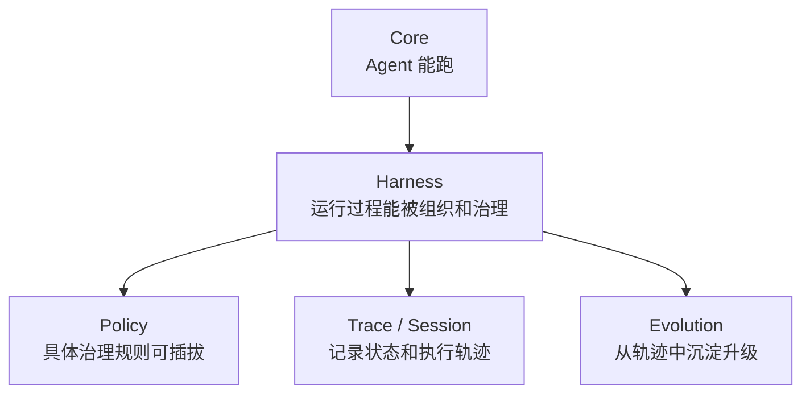
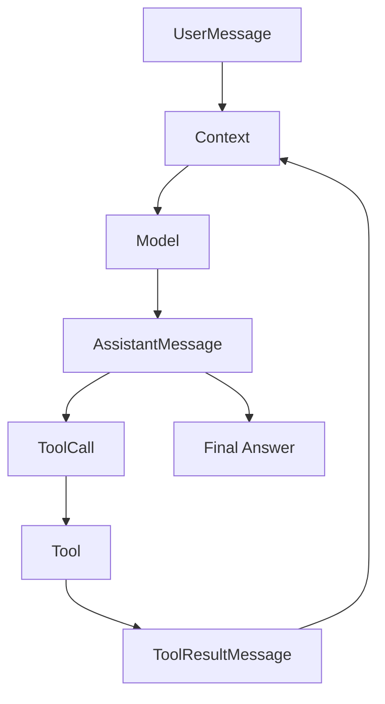

# Core 设计笔记

Core 是 EvoPi 的最小 Agent Runtime。

它只负责一件事：

```text
把用户输入、模型输出、工具调用、工具结果组织成一个稳定的多轮执行闭环。
```

Core 不应该承担具体场景治理。

例如这些不属于 Core 的主要职责：

- shell 命令是否危险
- 文件写入是否需要确认
- 金融数据是否过期
- 工具结果是否需要脱敏
- 是否需要写入长期记忆
- 是否需要创建 subagent

这些应该交给 Harness / Policy。

## Core 的核心对象

第一版 Core 固定为九项能力：

```text
1. 基础类型协议
2. 消息上下文
3. 模型统一接口
4. 工具统一接口
5. 最小 Agent Loop
6. 工具执行结果回填
7. 基础事件输出
8. Agent 对象外壳
9. 流式输出支持
```

这九项对应的原则是：

```text
Core 只负责让 Agent 能稳定跑起来。
```

它不负责让 Agent 变聪明，也不负责具体场景的治理策略。

## Core 文件边界

第一版文件分工如下：

```text
evopi/core/types.py
  基础类型协议；放跨模块共享的轻量类型。

evopi/core/messages.py
  SystemMessage / UserMessage / AssistantMessage / ToolResultMessage。

evopi/core/context.py
  AgentContext；管理当前模型调用可见的消息上下文。

evopi/core/model.py
  Model 接口；屏蔽具体模型厂商调用方式。第一版直接支持真实模型调用，FakeModel 只作为测试替身。

evopi/core/tool.py
  Tool / ToolCall / ToolResult；定义工具如何被模型请求、执行和回填。

evopi/core/events.py
  Core 级事件；表达 agent、turn、message、tool execution 和 error 等运行过程。

evopi/core/cancellation.py
  AbortSignal 与内部 AbortController；表达一次运行的只读协作式取消状态。

evopi/core/run.py
  AgentLoopResult / AgentRunState / AgentEndReason；表达一次运行的结构化结果。

evopi/core/agent_loop.py
  最小 Agent Loop；负责 model_call → tool_call → tool_result → next_turn。

evopi/core/agent.py
  Agent 对象外壳；保存 messages/tools，提供 run/prompt/subscribe/reset 等基础入口。

evopi/core/stream.py
  流式输出的辅助层；第一版就纳入 Core 边界，负责把模型流式事件转换为 Core 可消费的事件序列。
```

## Core 不包含什么

这些能力暂时不放进 Core：

```text
session 持久化
memory
skill
context compact
subagent
policy 复杂治理
用户插话 / steering / follow-up
任务树
trace replay
supervisor
```

它们属于 Harness / Policy / Evolution。

## Lifecycle v2 与四层终止协议

Core 生命周期事件采用 Pi 风格的语义：

```text
agent_start / agent_end
turn_start / turn_end
message_start / message_update / message_end
tool_execution_start / tool_execution_end
```

`model_start` 和 `error` 作为 EvoPi 观测事件保留；Policy 与 Confirmation 事件由
Harness 通过同一事件通道扩展。`turn_end` 携带 AssistantMessage 和本轮工具结果，
`agent_end` 携带本次运行新增消息、结构化结束原因、`turns_used / max_turns` 和可选错误。
`turn_start` 固定携带当前 Turn、上限与包含当前 Turn 的剩余预算。自然完成由最后一个
Assistant `message_end` 表达，不再额外产生 `final_message`。

终止控制分为四层：

```text
工具级：ToolResult.terminate 是跳过下一次模型调用的提示
批次级：非空批次中所有最终工具结果均 terminate=True 才早停
Turn 级：ShouldStopAfterTurn 在 after_turn 观察完成后请求优雅停止
Run / Provider 级：Agent Abort 与 Provider aborted/error stop reason 独立处理
```

四层控制现已全部接通。`AgentEndReason` 固定为
`completed / terminated / aborted / error / turn_limit`。`Agent.prompt()` 继续返回
AssistantMessage，结束状态由只读 `Agent.last_run` 和 `agent_end` 暴露。

Core 只维护严格 Turn 计数和只读 `Agent.current_turn`。Retry attempt 仍属于同一个 Turn，
不会额外消耗预算。达到上限后 Core 保持原有 `turn_limit` 语义；“最后一轮移除工具并
要求收尾”是 CodingHarness 的领域策略，不进入裸 Agent 或 BaseHarness。

每次运行创建独立、只读的 `AbortSignal`，通过仅限关键字的可选 `signal` 参数传播给
Model、Tool、Hook、Context Provider、Confirmation Handler 和 Event Listener。旧式回调
签名继续兼容。`Agent.abort()` 是同步、线程安全、幂等的当前运行请求；空闲调用无效。
`is_running`、`signal` 和 `wait_for_idle()` 为 Harness、CLI 与未来 TUI 提供组合入口。

Abort 的提交语义是“提交前中止优先，已提交事实不回滚”。已进入的 Hook 与 Listener
继续完成；Provider 流和异步 Tool 可被主动取消；普通同步 Tool 不能被安全抢占，会在
返回后标记 `completed_after_abort`。当前 Tool 批次仍为每个 ToolCall 产生完整的
`tool_execution_end` 与 ToolResultMessage，未开始的兄弟工具标记 `skipped`，且不进入
`before_tool_call`，但仍进入 `after_tool_call`。Policy 可以观察中止，不能把中止结果改回
成功或 `terminate=True`。

模型流中止时保留已完成文本，并用 `stop_reason=aborted` 提交 AssistantMessage；未完成
ToolCall 从正式消息中移除，原始增量保存在 `partial_tool_calls` 元数据及事件/Trace 中。
工具、Hook 或确认阶段发生的 Abort 不改写已经提交的 Provider stop reason，运行级原因
仍为 `aborted`。外部取消等待 `prompt()` 的 Task 时，Core 完成清理后重新抛出
`asyncio.CancelledError`。

工具调用仍按 AssistantMessage 中的顺序执行。单个结果的 `terminate=True` 不跳过
兄弟工具；阻断、拒绝和错误默认不早停，以便模型读取错误 ToolResult 后给出总结。

## Provider Reliability v1

Provider 可靠性分为两层，避免厂商特例进入 Agent Loop：

```text
Adapter：把 HTTP、SSE、transport 和 timeout 异常归一为 ModelErrorInfo
Core：根据结构化 retryable、预算和 Retry-After 重试完整模型调用
```

`ModelErrorKind` 固定覆盖 `authentication / permission / invalid_request / not_found /
context_overflow / quota_exhausted / rate_limited / overloaded / timeout / connection /
server / protocol / route_unavailable / unknown`。`ModelErrorInfo` 同时携带安全截断消息、Provider、HTTP 状态、
Provider code、`retry_after`、request ID 和元数据；通过 `ModelError.info`、
`AgentRunState.error_info`、`error` / `agent_end` 事件和 Trace 暴露。字符串 `error` 保留兼容。

`ModelRetryConfig` 采用“额外重试次数”语义。裸 `Agent` 默认关闭；Harness 默认开启并使用
三次额外重试、2/4/8 秒指数退避、60 秒最大等待且无随机抖动。只有
`rate_limited / overloaded / timeout / connection / server` 默认可重试。合法且更长的
`Retry-After` 优先；超过最大等待时立即结束，不进入静默长等待。

所有 attempt 共享同一 Run 和 Turn，`model_start.attempt` 从 1 开始。每次 attempt 都重新
生成 Context 快照并执行 Context Provider 与 `before_model_call`；成功后才执行
`after_model_call` 并提交 AssistantMessage。失败 attempt 仍产生完整的
`message_start/update/end`，以 `stop_reason=error` 保存部分文本和原始 ToolCall 增量，只进入
Event / Trace，不写入 AgentContext。`model_retry_start` 与 `model_retry_end` 记录预算、延迟、
结构化错误和最终结果。最终失败才进入公共 `error` / `agent_end(reason=error)` 路径。

Abort 的优先级高于重试：活动请求、部分输出后的流和退避等待均可被现有 AbortSignal
打断；外部取消 `prompt()` Task 时，Core 完成重试任务清理后继续抛出
`asyncio.CancelledError`。Adapter 的 `timeout` 是连接与流式 I/O 空闲超时，不是单次调用或
整个 Run 的墙钟总时限。

### Model Route 与 Circuit Breaker v1

Core 不决定 Provider 顺序，也不持有 Circuit。`ModelCallExecutor` 只接受可选的
provider-neutral `ModelAttemptRouter`，并把每个实际请求的 `ModelAttemptInfo` 写入模型、
消息与 Retry 事件。Router 可以在共享的 attempt 预算内选择不同 Model；没有 Router 时
原有单模型 Retry 行为保持不变。

失败 attempt 无论是否还有 Retry 预算，都会先通过 Router 记入健康状态。只有非
`aborted` 的完整响应才记为成功；Abort、确认拒绝、Listener 异常或 Run 清理必须释放未
结算的 half-open probe，不能把取消误报为健康恢复。Router 选择和 Circuit 状态属于
Harness/AI 基础层，Core 不依赖具体 Provider、Policy 或 Session。

### 原生 OpenAI Responses Adapter

`OpenAIResponsesModel` 通过既有 `Model.stream()` 接入上述执行器，不向 Agent Loop
引入 Provider 特例。它与 OpenAI-compatible Chat Completions Adapter 是两个独立的
显式 Provider：`openai` / `openai-compatible` 保持原行为，`openai-responses` 才调用
`{base_url}/responses`。

EvoPi 自己持有会话状态。Responses 请求固定使用 `store=false`，不发送
`previous_response_id` 或 Conversation ID，并将当前 SystemMessage 合并为本次
`instructions`。User、Assistant 和 ToolResult 历史会完整转换为 Responses `input`；
Tool 使用扁平 function schema 且 `strict=false`，保持当前 Tool Schema 兼容边界。

成功或 incomplete 的终端 Response 是正式 AssistantMessage 的权威来源。完整 JSON-safe
`output`、response ID、状态和 incomplete details 写入 Provider metadata，并由现有
Session v3 / Checkpoint 严格 Codec 原样保存；下一次请求优先重放该输出。旧 Session、
缺少兼容 Provider State 的消息和 Provider 切换通过规范化文本与 ToolCall 重建。状态
额外绑定哈希后的模型与 Base URL 兼容身份；同 Provider 的不同模型或端点也不会互相
重放私有 output。若同名 Provider State 已存在但结构损坏，则在网络请求前产生不可重试
protocol 错误。

流式 text / refusal / function-call delta 继续进入 Core Stream；终端 output 决定最终文本、
ToolCall 与 stop reason。Reasoning 等非执行输出只保存在 Provider State 中，不生成新的
Core Event。OpenAI 内置执行工具调用不映射成 EvoPi ToolCall，而是以
`unsupported_response_item` fail closed，避免绕过 Policy 与 ToolExecutor。

## 模型调用边界

EvoPi 第一版不只做 FakeModel。

真实模型调用进入第一版边界，原因是：

```text
Agent Runtime 的很多关键设计都和真实模型流式输出、tool call 格式、错误处理有关。
```

因此：

```text
真实模型调用是主路径；
FakeModel 是测试替身。
```

模型接入分两层：

```text
evopi/core/model.py
  定义 Core 看到的统一 Model 接口。

evopi/ai/
  负责对接具体厂商 API，并适配为统一 Model 接口。
```

第一批可优先支持：

```text
OpenAI-compatible Chat Completions API
OpenAI Responses API
Anthropic Messages API
```

后续再扩展 Gemini、DeepSeek、Qwen、本地模型等。

## 流式输出边界

流式输出进入第一版 Core。

原因：

```text
真实 Agent 产品需要及时展示模型输出、工具调用开始、工具结果和错误。
```

第一版不一定实现复杂 UI，但 Core 应该能输出事件流。

流式输出的职责拆分：

```text
Model
  产生模型厂商原始流式响应。

AI Adapter
  把厂商流式响应转换成 EvoPi 内部流式事件。

Core Stream
  消费内部流式事件，逐步构造 AssistantMessage，并向外 emit Core Event。

AgentLoop
  在流式结束后，根据完整 AssistantMessage 判断是否有 tool_calls。
```

设计原则：

```text
流式过程用于展示和增量构造；
进入 Context 的仍然是最终完整消息。
```

## Core 和上层的关系



它们的关系：



## 1. Message

Message 是整个 Core 的血液。

用户输入、模型输出、工具结果、系统提示词，最终都会以 Message 的形式进入上下文。

第一版先保留四类消息：

```text
SystemMessage
UserMessage
AssistantMessage
ToolResultMessage
```

暂时不把 DeveloperMessage、ReasoningMessage、PartialMessage 作为第一版必需项。

### SystemMessage

用于描述 Agent 的全局行为规则。

例如：

```text
你是一个 coding agent。
回答前先检查项目上下文。
危险操作前必须请求确认。
```

### UserMessage

用户输入。

它可以是普通文本，也可以在未来扩展为多模态内容。

第一版先只支持文本。

### AssistantMessage

模型输出。

它可能有两种形态：

```text
1. 普通文本回复
2. 带 tool_calls 的中间消息
```

这点很重要：AssistantMessage 不一定是最终回答。

如果它带有 tool_calls，AgentLoop 还要继续执行工具并进入下一轮模型调用。

### ToolResultMessage

工具执行结果。

它不是给用户看的最终回答，而是回填给模型的结构化消息。

它至少要表达：

- 对应哪个 tool_call
- 工具是否成功
- 工具返回内容
- 是否为错误
- 是否建议终止 loop

## Message 的初步字段边界

第一版可以先这样设计：

```text
BaseMessage
  id
  role
  content
  created_at
  metadata

AssistantMessage
  tool_calls
  stop_reason

ToolResultMessage
  tool_call_id
  tool_name
  is_error
  terminate
```

字段设计原则：

```text
Message 只描述事实，不直接做治理判断。
```

例如：

```text
terminate = True
```

只表示该工具结果同意在当前批次完成后跳过下一次模型调用。只有非空批次中的每个
最终工具结果都同意，Core 才会提前结束运行。

至于为什么停止、是否允许停止、是否通知用户，是 Harness / Policy 的事情。

## 设计取舍

### ModelCallExecutor

`ModelCallExecutor` 是 Core 内部可复用的 Provider-neutral 调用执行器，只负责一次模型
调用的 Attempt、确定性 Retry、Abort、Deadline wait 和结构化错误事件。它不知道
Policy、Session、Harness、Compaction 或工具。`AgentLoop` 使用它完成普通 Turn；
Harness 的内部模型操作也通过同一 Core 可靠性路径运行。

### 为什么 ToolResult 也要是 Message？

因为模型下一次调用需要看到工具结果。

如果工具结果不进入消息序列，下一次模型调用就不知道工具执行发生了什么。

### 为什么 AssistantMessage 可以同时有 content 和 tool_calls？

有些模型会一边解释自己要做什么，一边发起工具调用。

所以第一版允许：

```text
AssistantMessage(content="我先读取文件", tool_calls=[...])
```

### PartialMessage 放在哪里？

流式输出第一版就要做，但不一定把 PartialMessage 作为正式 Message 类型写入 Context。

更合适的边界是：

```text
Partial / Delta 属于 Event / Stream；
完整 AssistantMessage 属于 Context。
```

也就是说：

```text
流式过程通过 Event 暴露；
上下文保存最终完整消息。
```

## CLI 产品化边界

`chat`、`run`、REPL Command、配置诊断、Tool ceiling 和动态 Coding Prompt 都在
Harness/Domain/CLI 层实现。Core 的 Model、Message、ToolResult、Event 和结束原因协议
保持不变；`run --json` 只是对 `AgentRunState` 与最终 AssistantMessage 的安全投影。
