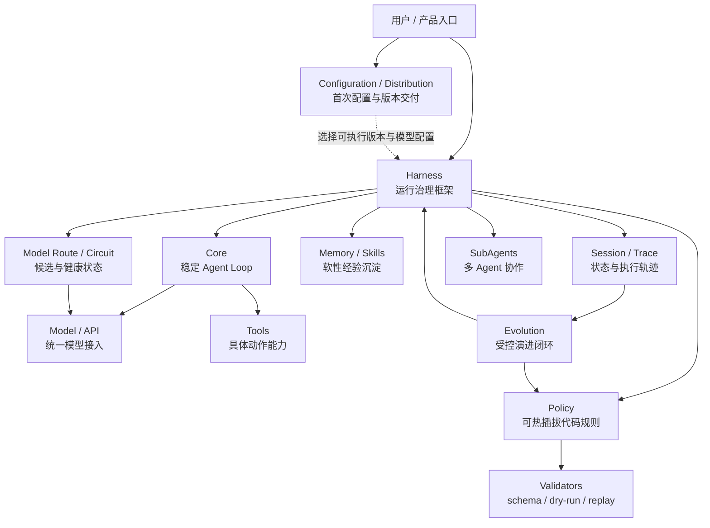

# EvoPi 全局架构图景

> Remote 是最外层信任与传输边界：TLS、设备认证、Scope 与控制租约之后仍进入同一个
> RPC v2 Host 和 CodingHarness，不建立第二条 Tool 或授权通道。详见
> [REMOTE_GATEWAY.md](REMOTE_GATEWAY.md)。

本文件用于固定当前阶段对 EvoPi 最终形态的理解。

## 一句话定位

EvoPi 是一个支持代码级执行策略演进的 Python Agent Runtime。

它不是“又一个代码助手”，而是尝试把 Agent 的执行链路治理能力做成可插拔、可验证、可沉淀、可演进的系统。

## 核心判断

```text
Prompt / Memory / Skill 是软性能力沉淀；
Policy / Harness 是运行时行为治理的代码级沉淀。
```

EvoPi 的重点是后者。

## 分层架构



Configuration 与 Distribution 是产品宿主边界：前者为 Coding CLI 解析用户模型配置，
后者安装和选择受验证的 EvoPi 可执行版本。二者都不进入 Core，也不获得绕过 Policy、
Confirmation 或 Harness 的执行权限。

## 各层职责

### Core

Core 是稳定主线。

它负责最小 Agent Loop：

```text
model_call → tool_call → tool_result → next_turn → final_response
```

Core 不负责具体场景治理。

### Harness

Harness 是运行治理框架。

它负责定义 Agent 运行中哪些地方可以被治理：

```text
before_model_call
after_model_call
before_tool_call
after_tool_call
after_turn
before_memory_write
before_subagent_spawn
before_session_compact
```

Harness 还负责组织：

- session
- context
- events
- trace
- tools
- policy registry
- subagents
- lifecycle

一句话：

```text
Harness 定义哪里可以被治理，以及治理结果如何影响主循环。
```

### Policy

Policy 是挂在 Harness 节点上的代码级治理规则。

它负责具体判断：

```text
allow
block
rewrite_args
require_confirmation
trigger_validation
terminate
```

一句话：

```text
Policy 定义在这些位置上具体怎么治理。
```

### Tools

Tools 是 Agent 能执行的具体动作。

例如：

```text
read_file
write_file
shell_command
web_search
memory_write
subagent_spawn
```

Tool 提供能力，Policy / Harness 决定这些能力如何被允许、约束、验证。

### Memory / Skills

Memory 和 Skills 属于软性经验沉淀。

它们影响模型看到什么、知道什么、采用什么任务经验。

但它们不应该替代 runtime 层的硬约束。

### Session / Trace

Session 是跨 Run、跨进程存在的任务容器，以追加式 JSONL Entry Log 保存已经提交的
对话事实，并在每个 Run 结束后生成不可变 Checkpoint 恢复投影。层级固定为：

```text
Session → Run → Turn → Model Attempt
```

Session schema v4 的 Entry 使用 `entry_id / parent_id` 构成持久树，并通过
`leaf_selected` 保存当前活动路径。branch、fork、compact、Plugin State 与证据绑定的
Merge 已经进入事实协议；Checkpoint 只是可校验恢复投影，活动路径仍以追加式日志为准。
裸 Core 不依赖存储；Harness 负责把正式消息和 Run 边界接入 Session。失败 attempt 和
运行治理细节不进入 Session，仍由 Trace 保存。

Trace 记录执行过程：

```text
用户输入
模型输出
工具调用
工具结果
policy decision
验证结果
错误和重试
候选切换和 circuit 状态
```

多 Provider 可靠性仍遵循同一分层：AI 层提供无 Policy 的候选与健康原语，Core 只执行
provider-neutral Attempt，Harness 在任何跨候选请求前运行 Policy / Confirmation。原始
failure domain 不进入 Trace；Session 只保存 route fingerprint，不持久化短期 Circuit 状态。

Trace 是后续演进的原材料。

Session 与 Trace 互补：Session 回答“下一次从什么正式上下文继续”，Trace 回答“此前
具体发生了什么以及为何这样治理”。详细协议见
[`SESSION_DESIGN.md`](SESSION_DESIGN.md)。

### Validators

Validators 用于验证候选升级是否可靠。

包括：

- schema check
- dry-run
- trace replay
- failure case replay
- supervisor review

## Harness 和 Policy 的关系

```text
Harness = 插槽系统 / 调度框架 / 运行治理结构
Policy = 插入插槽的具体代码规则
```

两者不是割裂关系。

```text
Harness 使用 Policy；
Policy 依附 Harness 生效。
```

## Evo 边界

当前固定为三级：

```text
Policy 高频演进
Harness 低频演进
Core 默认稳定
```

### Policy Evolution

新增、升级、禁用、回滚某个 Policy。

例如：

```text
shell_safety_policy v1 → shell_safety_policy v2
```

这是 EvoPi 的主要演进对象。

### Harness Evolution

新增 Hook 点、调整 Policy 冲突处理方式、改变 session/subagent 治理流程。

这是高级演进对象，必须强验证。

### Core Stability

Core 是稳定内核，不作为常规自演进对象。

## 演进闭环

```mermaid
flowchart LR
    Trace["Trace / Failure Cases"] --> Pattern["模式发现"]
    Pattern --> Opportunity["不可变 Opportunity Evidence"]
    Opportunity --> Candidate["候选 Policy / Harness 改动"]
    Candidate --> Schema["Schema Check"]
    Schema --> DryRun["Dry-run / Replay"]
    DryRun --> Supervisor["Supervisor Evidence / Review"]
    Supervisor --> Human["Human Approval"]
    Human --> Approval["Digest-bound Approval"]
    Approval --> Active["Explicit Active Selection"]
    Active --> Registry["Transactional Harness Reload / Rollback"]
```



原则：

```text
执行 Agent 不能自己给自己的演进授权。
```

当前 v1 先使用隔离 Worker 与确定性 Supervisor Report 形成技术证据；未来可以在这层之上
增加模型驱动 Supervisor，但它仍不能替代人工授权。

Policy Evolution v1 已把这条闭环落实为目录候选、非执行式静态检查、隔离 Worker、
不可变 Evidence、人工批准/拒绝、独立活动指针、Harness 事务装配和回滚。批准不等于
启用，技术 `passed` 也不等于人工授权。Coding CLI 默认读取当前用户活动集；裸
BaseHarness 不隐式读取用户目录。

Pattern Discovery v1 进一步补齐 Trace 到候选之前的只读入口：它只分析显式提供的
`before_tool_call` Policy/Confirmation 证据，以不含原始参数值的语义签名产生不可变
Opportunity Report。报告标记重复拒绝、决策分歧和重复批准，但不生成候选、不建议
具体 Policy 动作，也不改变运行时。

Policy Candidate Generation v1 补齐 Opportunity 到候选之间的唯一模型步骤：它从显式
`--trace` 路径重建所选 Opportunity 引用的原始证据（digest/line/Run/决策/参数结构全量
复核），分两个语义阶段（Proposal → 用户确认 → Candidate bundle）请求模型 Provider，并
物化为非启用、带 Host 固定 Manifest 的目录候选。生成绝不审查、批准、激活、重载、注册
或执行候选；候选继续走既有 Schema / Dry Run / Replay / Supervisor / Approval /
Activation 人工治理链。Generation Record 不可变且不含原始参数、完整 Prompt 或模型响应。

## 两种演进形态

### 持续挂载式演进

不断生成新的 Policy / Skill / Tool 并注册。

适合处理长尾问题，但需要治理扩展膨胀和冲突。

### Policy Pack 式演进

把一组 Policy 整理成可复用策略包。

例如：

```text
strict_coding_policy_pack
finance_audit_policy_pack
safe_shell_policy_pack
```

系统识别到常见场景时，推荐或切换 Policy Pack。

当前倾向：

```text
持续挂载产生经验；
Policy Pack 整理经验。
```

## 最终图景

EvoPi 的最终图景不是一个单一 Agent 产品，而是一套 Agent Runtime：

```text
稳定 Core
可扩展 Harness
可热插拔 Policy
Trace 驱动经验沉淀
Supervisor Agent 隔离验证
Human Confirmation 最终上车
```

## 运行时资源治理

可执行扩展与软性资源采用不同信任链：

```text
Policy / Plugin → Candidate → Review → digest-bound Activation → immutable snapshot
Skill / Prompt  → Workspace Trust → protected write → Trace
```

Plugin 发现阶段不得 import 候选 Python。项目 Plugin 同时需要摘要批准和 Workspace
Trust；源码变化只产生 stale 状态，运行时继续使用已批准快照。SubAgent 是父 Harness
的受治理子运行，安全 Policy、Confirmation、Abort、Deadline 与 Tool capability
ceiling 均不可弱化。

## 两层产品入口

Coding CLI 将现有能力组织成“交互工作台 + 管理与自动化命令”两层入口。它只是
CodingHarness 的产品宿主：`evopi`/`chat` 负责持续交互，`run` 提供稳定的一次性
结果，`session/policy/plugin/config/doctor` 暴露明确的管理边界。CLI Tool ceiling
位于 Harness 控制层，与 Plugin 覆盖取交集；Core 不感知命令树、终端渲染或用户配置。

动态 Coding Prompt 由最终活动 Tool 视图生成，能力变化后刷新。Prompt 只陈述当前
真实能力与治理事实，不把 Session UI 命令或未启用能力伪装成模型能力。完整产品契约
见 `CLI_PRODUCT.md`。

## 宿主交互层

终端、桌面 UI、IDE 或未来 RPC 宿主都位于 Harness 外侧。当前本地 Host Integration
Foundation 由三部分组成：Confirmation Broker 负责可恢复的确认状态，Event Stream
负责严格编码、递增序号和有界回放，`HarnessRpcHost` 只通过 BaseHarness 公共接口编排
Run、Abort、steering、follow-up 和状态查询。Core 仅提供 Run 内、安全点驱动的通用消息
调度原语；宿主交互和治理仍不下沉，也不建立第二条 Tool 或 Policy 执行通道。

RPC v2 在该边界上增加连接级初始化、Run 身份绑定、Confirmation revision 和
`stream_id + sequence` 游标；`EvoPiRpcClient` 只负责类型化传输、Replay/Live 连续性与
宿主生命周期。v1 作为兼容协议保留一个正式版本。两种版本仍复用同一个
`HarnessRpcHost`、Confirmation Broker 和 Event Stream。

RPC 客户端只能答复由 Policy 创建的 pending request；不能自行创建 Confirmation、
越过 `block` 或直接调用 Tool。当前 JSONL stdio 传输只面向同机受信宿主，不包含网络
监听、认证或多租户隔离。

Steering 与 follow-up 都是直接用户输入而非 Policy 决策：前者在完整 Turn 后继续当前
Run，后者只在终止候选点继续。投递后形成正常 `UserMessage` 并进入 Session；由它触发的
后续 ToolCall 仍经过原有 Policy、Confirmation、Trace 与 Deadline 链。
