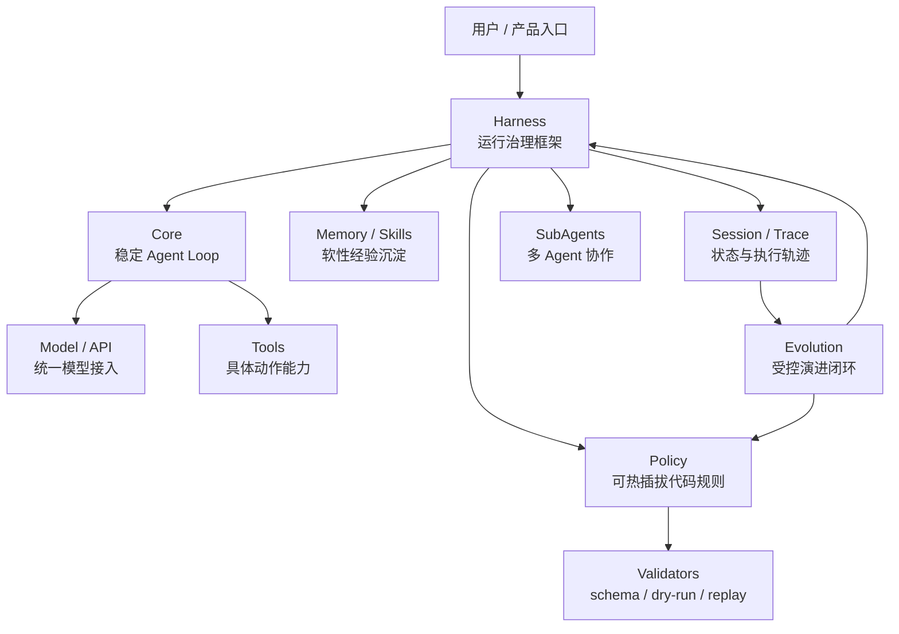

# EvoPi 全局架构图景

本文件用于固定当前阶段对 EvoPi 最终形态的理解。

## 一句话定位

EvoPi 是一个支持代码级执行策略演进的 Python Agent Runtime。

它不是“又一个代码助手”，而是尝试把 Agent 的执行链路治理能力做成可插拔、可验证、可沉淀、可演进的系统。

## 核心判断

```text
Prompt / Memory / Skill 是软性能力沉淀；
Policy / Harness 是运行时行为治理的代码级沉淀。
```

EvoPi 的重点是后者。

## 分层架构



## 各层职责

### Core

Core 是稳定主线。

它负责最小 Agent Loop：

```text
model_call → tool_call → tool_result → next_turn → final_response
```

Core 不负责具体场景治理。

### Harness

Harness 是运行治理框架。

它负责定义 Agent 运行中哪些地方可以被治理：

```text
before_model_call
after_model_call
before_tool_call
after_tool_call
after_turn
before_memory_write
before_subagent_spawn
before_session_compact
```

Harness 还负责组织：

- session
- context
- events
- trace
- tools
- policy registry
- subagents
- lifecycle

一句话：

```text
Harness 定义哪里可以被治理，以及治理结果如何影响主循环。
```

### Policy

Policy 是挂在 Harness 节点上的代码级治理规则。

它负责具体判断：

```text
allow
block
rewrite_args
require_confirmation
trigger_validation
terminate
```

一句话：

```text
Policy 定义在这些位置上具体怎么治理。
```

### Tools

Tools 是 Agent 能执行的具体动作。

例如：

```text
read_file
write_file
shell_command
web_search
memory_write
subagent_spawn
```

Tool 提供能力，Policy / Harness 决定这些能力如何被允许、约束、验证。

### Memory / Skills

Memory 和 Skills 属于软性经验沉淀。

它们影响模型看到什么、知道什么、采用什么任务经验。

但它们不应该替代 runtime 层的硬约束。

### Session / Trace

Session 负责任务生命周期。

Trace 记录执行过程：

```text
用户输入
模型输出
工具调用
工具结果
policy decision
验证结果
错误和重试
```

Trace 是后续演进的原材料。

### Validators

Validators 用于验证候选升级是否可靠。

包括：

- schema check
- dry-run
- trace replay
- failure case replay
- supervisor review

## Harness 和 Policy 的关系

```text
Harness = 插槽系统 / 调度框架 / 运行治理结构
Policy = 插入插槽的具体代码规则
```

两者不是割裂关系。

```text
Harness 使用 Policy；
Policy 依附 Harness 生效。
```

## Evo 边界

当前固定为三级：

```text
Policy 高频演进
Harness 低频演进
Core 默认稳定
```

### Policy Evolution

新增、升级、禁用、回滚某个 Policy。

例如：

```text
shell_safety_policy v1 → shell_safety_policy v2
```

这是 EvoPi 的主要演进对象。

### Harness Evolution

新增 Hook 点、调整 Policy 冲突处理方式、改变 session/subagent 治理流程。

这是高级演进对象，必须强验证。

### Core Stability

Core 是稳定内核，不作为常规自演进对象。

## 演进闭环

```mermaid
flowchart LR
    Trace["Trace / Failure Cases"] --> Pattern["模式发现"]
    Pattern --> Candidate["候选 Policy / Harness 改动"]
    Candidate --> Schema["Schema Check"]
    Schema --> DryRun["Dry-run / Replay"]
    DryRun --> Supervisor["Supervisor Agent Review"]
    Supervisor --> Human["Human Confirmation"]
    Human --> Registry["Registry Enable / Rollback"]
```



原则：

```text
执行 Agent 不能自己给自己的演进打分。
```

因此需要隔离的 Supervisor Agent。

## 两种演进形态

### 持续挂载式演进

不断生成新的 Policy / Skill / Tool 并注册。

适合处理长尾问题，但需要治理扩展膨胀和冲突。

### Policy Pack 式演进

把一组 Policy 整理成可复用策略包。

例如：

```text
strict_coding_policy_pack
finance_audit_policy_pack
safe_shell_policy_pack
```

系统识别到常见场景时，推荐或切换 Policy Pack。

当前倾向：

```text
持续挂载产生经验；
Policy Pack 整理经验。
```

## 最终图景

EvoPi 的最终图景不是一个单一 Agent 产品，而是一套 Agent Runtime：

```text
稳定 Core
可扩展 Harness
可热插拔 Policy
Trace 驱动经验沉淀
Supervisor Agent 隔离验证
Human Confirmation 最终上车
```

