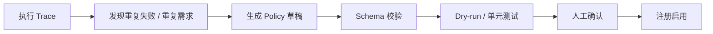

# Policy 系统设计

## Policy 是什么

Policy 是挂在 Agent 执行链路关键节点上的策略插件。

它不是普通工具，也不是单纯提示词，而是 runtime 层面的执行约束。

在 EvoPi 中，Policy 不只是一个函数，而是一个可管理资产：

```text
可注册
可启用 / 禁用
可验证
可追踪
可升级
可回滚
```

第一版不要求完整实现所有高级能力，但核心对象必须预留可演进元数据。

设计原则：

```text
功能可以 MVP，架构要 Evolution-ready。
```

## Hook 和 Policy 的区别

```text
Hook 是位置。
Policy 是挂在这个位置上的策略。
```

例如：

```text
before_tool_call 是 Hook。
shell_safety 是 Policy。
```

## 三类核心 Policy

### BeforeToolPolicy

工具执行前运行。

可能返回：

- allow
- block
- require_confirmation
- rewrite_args
- add_warning

### AfterToolPolicy

工具执行后运行。

可能返回：

- cleaned_result
- mark_error
- truncate
- sanitize
- terminate

### ValidationPolicy

一轮执行后运行。

可能返回：

- pass
- fail
- need_retry
- validation_report

## 内置工具确认 Policy

`ToolConfirmationPolicy` 是通用的 `before_tool_call` Policy。它接收需要人工确认的
工具名集合，命中后返回 `require_confirmation`，但不负责展示界面或收集用户输入。

```python
ToolConfirmationPolicy(tool_names={"shell_command"})
```

它与安全阻断 Policy 保持独立：

```text
普通 shell_command
  → tool_confirmation: require_confirmation

危险 shell_command
  → tool_confirmation: require_confirmation
  → shell_safety: block
  → PolicyEngine 最终选择 block
```

因此人工确认不能覆盖明确的安全阻断。具体启用哪些工具由 Domain Harness 的 Policy
Pack 决定，而不是硬编码在通用 Policy 中。当前 Coding Policy Pack 默认对
`shell_command` 启用确认，工作区内的 `write_file` 不要求交互确认。

## 第一版 Policy 边界

第一版 Policy 系统固定包含 6 项能力：

```text
1. Policy 协议
2. Hook 绑定
3. PolicyDecision
4. Policy Registry
5. Policy Engine
6. Policy Pack
```

### 1. Policy 协议

每个 Policy 至少要说明：

```text
name
version
description
hooks
priority
enabled
source
risk_level
metadata
```

并提供统一执行入口：

```text
run(input) -> PolicyDecision
```

第一版可以只实现最小运行逻辑，但元数据要先保留。

### 2. Hook 绑定

Policy 必须明确挂在哪些 Hook 上。

例如：

```text
shell_safety_policy
  hook = before_tool_call

output_truncation_policy
  hook = after_tool_call

test_after_edit_policy
  hook = after_turn
```

### 3. PolicyDecision

PolicyDecision 是结构化治理结果。

第一版支持：

```text
allow
block
rewrite_args
require_confirmation
trigger_validation
terminate
```

同时携带：

```text
reason
risk_level
metadata
```

### 4. Policy Registry

Registry 负责：

```text
注册 policy
查询某个 hook 下有哪些 policy
启用 / 禁用 policy
按 priority 排序
按 policy pack 批量加载
```

### 5. Policy Engine

Engine 负责执行策略链：

```text
Hook 触发
  ↓
Registry 找到 policies
  ↓
Engine 逐个执行
  ↓
收集 decisions
  ↓
合并 final decision
  ↓
交给 Harness 应用
```

第一版冲突合并采用保守策略。

### 6. Policy Pack

Policy Pack 是一组 Policy 的组合。

例如：

```text
coding_policy_pack
  shell_safety_policy
  file_write_guard_policy
  output_truncation_policy
  test_after_edit_policy
```

它用于表达治理风格：

```text
relaxed_policy_pack
strict_policy_pack
interview_demo_policy_pack
```

第一版可以先做静态 pack，不做自动识别和自动切换。

## Evolution-ready 接口预留

第一版可以暂不完整实现这些能力，但接口和元数据要预留：

```text
policy version
policy metadata
policy enable / disable
policy priority
policy source
policy validation
policy dry-run
policy conflict resolution
policy rollback
policy generated flag
supervisor review result
```

这些字段和接口的意义是：

```text
现在可以轻实现；
未来不用推倒重构。
```

第一版可采用：

```text
validate() 只做 schema check
rollback 只记录 version，不做真实回滚
supervisor_review 只在 metadata 中预留状态
policy_source 先支持 builtins / project，后续扩展 generated
```

## 冲突处理原则

第一版可以采用保守优先级：

```text
block > require_confirmation > rewrite_args > trigger_validation > allow
```

也就是说，只要有一个 Policy 判断危险，就不直接放行。

## 受控演进闭环



这个闭环表达的是：Agent 可以辅助产生新策略，但策略必须经过验证才能进入 runtime。

## `before_tool_call` Trace Replay

第一版 Trace Replay 是候选 Policy 的离线回归验证层，不是完整 Agent 回放。

Harness 在每次 Policy Engine 求值后继续记录逐条 `policy_decision`，并额外记录一个
`policy_evaluation` 快照。快照包含 Hook、原始工具调用、参数、最终决策和各 Policy
决策，保证回放不依赖模型消息历史或运行中的工具注册表。

```text
历史 JSONL Trace
  ↓ 提取 before_tool_call 案例
空 AgentContext + 工具名 + 原始参数
  ↓ 只运行候选 Policy
候选决策与同名历史决策比较
  ↓
unchanged / changed / new / error
```

状态语义固定为：

- 历史中没有同名 Policy：`new`。
- `action` 或 `rewritten_args` 不同：`changed`。
- 两者相同：`unchanged`。
- Policy Engine 捕获到候选执行异常：`error`。

`changed` 只表示行为发生变化，需要 Supervisor / Human Review，不自动使报告失败。
Trace 解析错误、候选执行错误或没有可回放案例时，验证不通过。新 Trace 优先使用
`policy_evaluation`；没有快照时，v1 Trace 回退解析 `tool_call + policy_decision`，
v2 Trace 回退解析 `tool_execution_start + policy_decision`，避免已有执行记录失效。

回放过程不得调用模型、执行工具或触发 Confirmation Handler。第一版也不重建完整
消息历史，不支持依赖工具注册表、`after_tool_call` 结果或非空 `AgentContext` 的 Policy。
公共入口由 `evopi.validators` 导出，暂不增加 CLI 子命令。

## Evo 边界

EvoPi 的演进对象分层：

```text
Policy 高频演进
Harness 低频演进
Core 默认稳定
```

其中 Policy 是第一阶段主要演进对象。因为 Policy 是明确挂在 Hook 点上的规则插件，输入输出协议稳定，新增、禁用、升级、回滚都相对可控。

Harness 也可以演进，但它改变的是运行治理框架本身，例如新增 Hook 点、调整 Policy 冲突处理方式、改变 session/subagent 治理方式。这类演进影响更大，应该低频、强验证。

Core 负责最小 Agent Loop，默认不作为自演进对象。Core 的稳定性优先级高于灵活性。

## 演进形态

当前存在两种候选形态，后续需要继续讨论取舍。

### 1. 持续挂载式演进

系统在运行中不断沉淀新的 Policy / Skill / Tool，并注册为可用扩展。

优点：

- 灵活
- 增长感强
- 适合处理长尾问题

风险：

- 扩展数量可能膨胀
- 策略之间可能冲突
- 需要良好的检索、禁用和回滚机制

### 2. Policy 组合包式演进

系统把多条 Policy 总结成可复用的策略组合。

例如：

```text
strict_coding_policy_pack
finance_audit_policy_pack
safe_shell_policy_pack
```

当识别到常见场景时，自动切换或推荐启用对应 Policy Pack。

优点：

- 更容易管理
- 更适合产品化
- 面试表达更清晰

风险：

- 需要场景识别能力
- Pack 内部策略仍需处理冲突
- 可能不如单条 Policy 灵活

## 监督者 Agent

EvoPi 的演进不能由执行 Agent 单独决定。

当系统尝试生成、修改或启用新的 Policy / Harness 规则时，需要一个隔离的监督者角色参与验证。

监督者 Agent 的职责：

- 审查新 Policy / Harness 改动是否符合协议
- 回放历史 trace 或 failure cases
- 对比演进前后的效果
- 检查是否引入新的安全风险
- 给出 pass / fail / need_human_review

监督者 Agent 不直接参与当前用户任务执行，避免“自己做题自己判卷”的问题。

第一版可以先把监督者 Agent 做成离线验证流程：

```text
candidate policy
  ↓
schema check
  ↓
dry-run replay
  ↓
supervisor review
  ↓
human confirmation
  ↓
enable / reject
```
